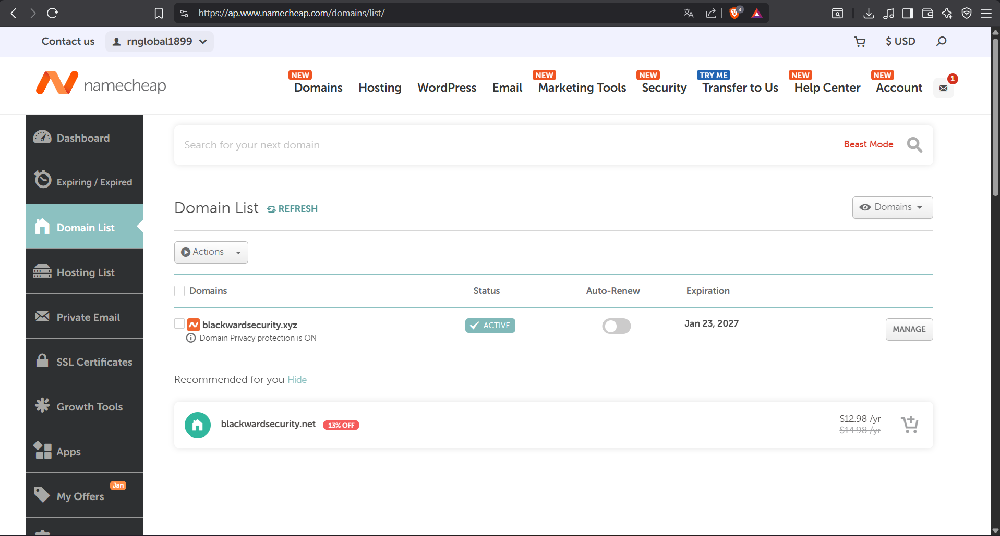
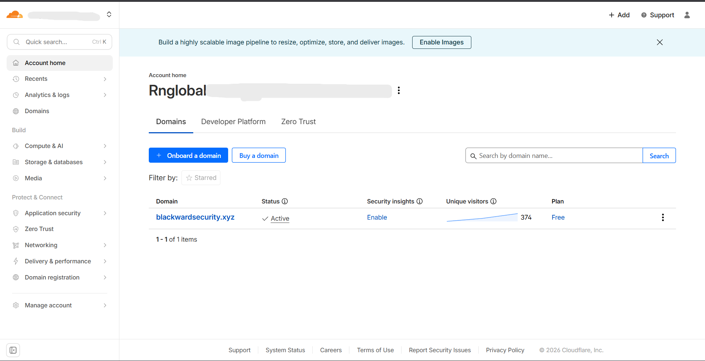
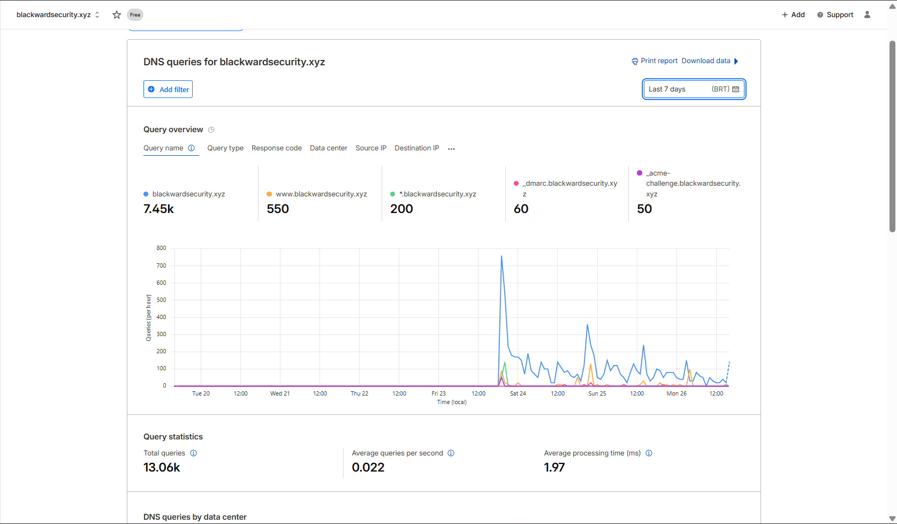
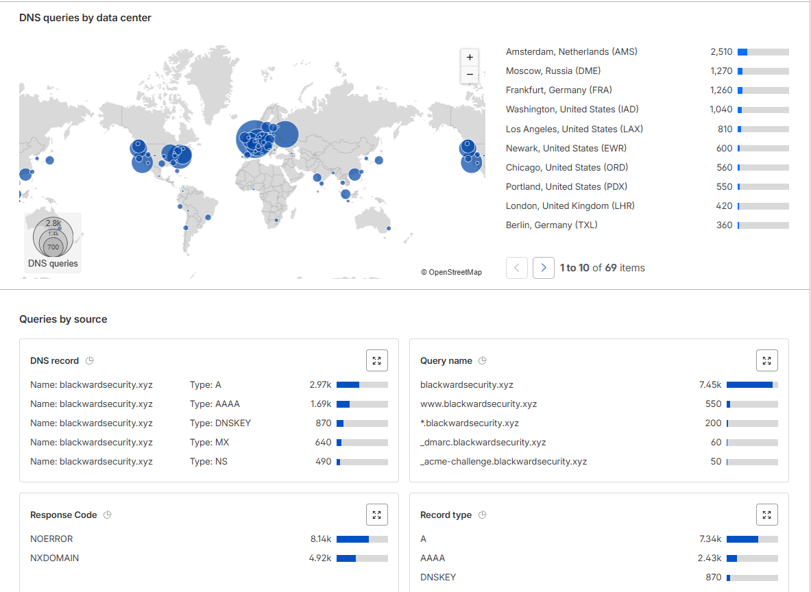
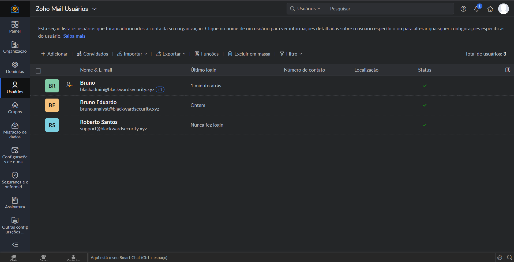
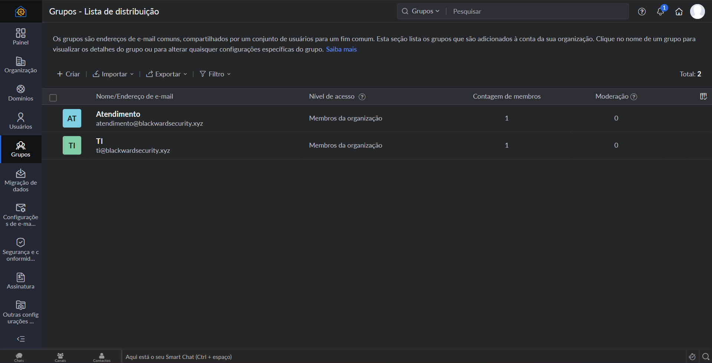
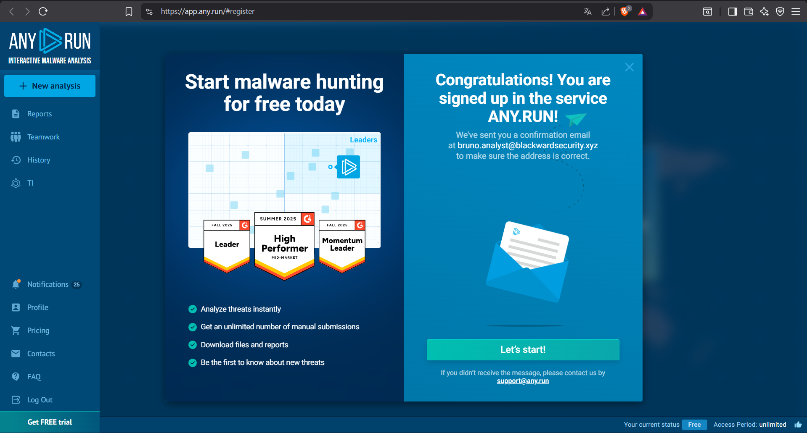

                                                🛡️ Core Infrastructure: Edge Management & Identity Hardening

Este módulo documenta a fundação técnica do BlackWard Security Labs. Minha prioridade foi estabelecer uma identidade digital resiliente e segura, garantindo que minha infraestrutura de rede e e-mail fosse reconhecida como autoritativa por plataformas de segurança de alto nível.

*1. GESTÃO DE BORDA E DNS (CLOUDFLARE)*                                                                                                                         
Iniciei o provisionamento adquirindo o domínio blackwardsecurity.xyz e delegando a autoridade de zona (SOA) para a Cloudflare para obter controle granular sobre o tráfego e proteção de borda.

figura 1: Domínio Adquirido na NameCheap
    

figura 2: Domínio atrás da cloudflare

*RESOLUÇÃO DE PROBLEMAS (TROUBLESHOOTING)*

    • Durante a transição, enfrentei a persistência do status "Invalid nameservers" no registrador original.
    • Solucionei o problema validando o protocolo ICANN e monitorando a propagação global via DNSChecker até o vencimento do cache de TTL (Time To Live).

*MÉTRICAS DE PERFOMANCE E ALCANCE GLOBAL*                                                                                                                       
Utilizei a telemetria da Cloudflare para auditar a eficiência da minha implementação:

    • Volume: Registrei 13.06k consultas DNS em 7 dias, com um tempo médio de processamento de apenas 1.97ms.   
    • Propagação Geográfica: Confirmei a resolução ativa em data centers estratégicos como Amsterdam (2.51k), Moscow (1.27k), Frankfurt (1.26k) e Washington (1.04k).
    • Distribuição de Registros: Realizei o mapeamento de A/AAAA (4.6k consultas) e MX (640 consultas) para garantir conectividade IPv4/IPv6 e roteamento de e-mail.

    figura 3: Relatório de consultas em 7 dias

    figura 4: Relatório de consultas em 7 dias
    
    [VER EVIDÊNCIAS]: Os gráficos mais detalhados de queries e o mapa de calor global podem ser encontrados na subpasta /evidence.

*2. HARDENING DE E-MAIL E DEFESA ATIVA (ZOHO MAIL)*                                                                                                             
Para a BlackWard Security, implementei uma estrutura de mensageria focada em resiliência e integridade, mitigando ataques de personificação e Email Spoofing.

*ARQUITETURA DE ENTREGA*    
                                                                                                                                    
    • Configurei três registros MX com prioridades escalonadas (10, 20, 50) para garantir que o fluxo de mensagens tenha redundância automática.

    figura 5: MX configurado

*TRÍADE DE SEGURANÇA (CAMADA 7)*                                                                                                                                
Implementei rigorosamente os protocolos de autenticação para garantir o não-repúdio e a integridade:    

    • SPF: Autorizei estritamente os endereços de envio da organização.

    figura 6: SPF verificado

    • DKIM: Configurei a assinatura criptográfica via seletor zmail._domainkey.

    figura 7: DKIM verificado

    • DMARC: Estabeleci uma política de Quarentena (p=quarantine) para monitorar e isolar qualquer tentativa de uso não autorizado do domínio.

    figura 8: Configuração DMARC

    figura 9: DMARC verificado

*3. GOVERNANÇA E CONTROLE DE ACESSO (IAM)*                                                                                                                      
Desenhei minha arquitetura de identidade para mitigar riscos de movimentação lateral e exposição de privilégios:

    • Separação de Deveres (SoD): Isolei a conta de Superadministrador (support@blackwardsecurity.xyz) exclusivamente para tarefas de gestão global.            
    • Princípio do Menor Privilégio (PoLP): Realizo acessos operacionais diários via conta bruno.analyst@, com permissões restritas ao grupo operacional "Analistas".                                                                                                                                                
    • Segurança de Acesso: Implementei MFA (TOTP) obrigatório e políticas de Session Timeout para invalidar sessões persistentes.

    figura 10: Separação de usuários

    figura 11: Separação de grupos

*4. AUDITORIA E VALIDAÇÃO FINAL*                                                                                                                                
Submeti toda a infraestrutura a testes de "fogo" para garantir a eficácia dos controles:

    • Teste de envio: Eu enviei uma mensagem de teste para um outro gmail para garantir que iria para a caixa de entrada principal, confirmando a configuração correta do servidor.

    figura 12: Email recebido

    • Mail-Tester Score (8.2/10): Obtive status PASS em todos os protocolos de autenticação. Analisei a perda de pontos como um fator extrínseco devido à reputação da TLD .xyz e à ausência proposital de cabeçalhos de marketing.

    figura 12: Teste de email

    • Validação ANY.RUN: Minha infraestrutura foi reconhecida como corporativa e segura, garantindo acesso à conta profissional da sandbox para minhas análises de malware.

    figura 12: Anyrun

Analista: Bruno Eduardo                    
Última Auditoria: 26/01/2026