# **4. Provisionamento Cloud e Gestão Avançada: Infraestrutura GCP (SOC e Management)**
 
`GCP Compute Engine` `Headless X11` `SSSD & realmd` `Zero Trust SSH`
 
| | |
|---|---|
| **Analista Responsável** | Bruno Eduardo |
| **Última Atualização** | 16 de Abril de 2026 |
 
---
 
Este relatório documenta o provisionamento do núcleo de processamento pesado do BlackWard Security LAB na Google Cloud Platform (GCP). O objetivo arquitetural desta etapa foi concretizar a estratégia de **Cloud Offloading**, movendo os serviços de alto consumo de hardware (SIEM e ferramentas de gestão) para instâncias robustas na nuvem. A fase exigiu intenso troubleshooting de renderização gráfica em servidores headless e a reconfiguração profunda de políticas de acesso nativas da GCP para permitir uma integração perfeita com o Active Directory local.
 
---
 
## **4.1 Computação de Alta Performance e Isolamento de Rede**
 
### **Decisão Estratégica: Dimensionamento Simétrico para Cargas Críticas**
 
Para suportar o processamento contínuo de logs do Elastic Stack (SOC) e os contêineres de orquestração (Management), optei por provisionar duas instâncias simétricas na região `us-east1` (South Carolina). Ambas as máquinas compartilham exatamente as mesmas especificações de hardware e sistema operacional base, diferenciando-se apenas por seus endereçamentos e funções lógicas.
 
| Parâmetro | Servidor Management (srv-gcp-mgmt-01) | Servidor SOC (srv-gcp-soc-01) |
|---|---|---|
| **Série / Tipo** | E2 / e2-standard-4 (4 vCPUs, 16GB RAM) | E2 / e2-standard-4 (4 vCPUs, 16GB RAM) |
| **Armazenamento** | 100GB SSD Persistent Disk | 100GB SSD Persistent Disk |
| **Sistema Operacional** | Ubuntu 22.04 LTS | Ubuntu 22.04 LTS |
| **Endereço Interno** | 10.142.0.2 (nic0) | 10.142.0.3 (nic0) |
| **Endereço Externo** | 34.139.85.12 (nic0) | 34.23.17.230 (nic0) |
| **Sub-rede** | default IPv4 (10.142.0.0/20) | default IPv4 (10.142.0.0/20) |
| **Tags de Rede** | http-server, https-server, mgmt-server | http-server, https-server, mgmt-server |
 
Ambas as máquinas foram ingressadas na malha SD-WAN via SSH, com um único comando que instala e autentica o agente de forma encadeada:
 
```bash
curl -fsSL https://tailscale.com/install.sh | sh && sudo tailscale up --authkey <authkey>
```
 
Após validar a conectividade via ICMP com o host físico, o acesso SSH foi restrito à rede Tailscale — fechando a porta 22 para a internet pública e mantendo apenas o intervalo de IPs do proxy da Google Cloud liberado para acesso emergencial via navegador.
 
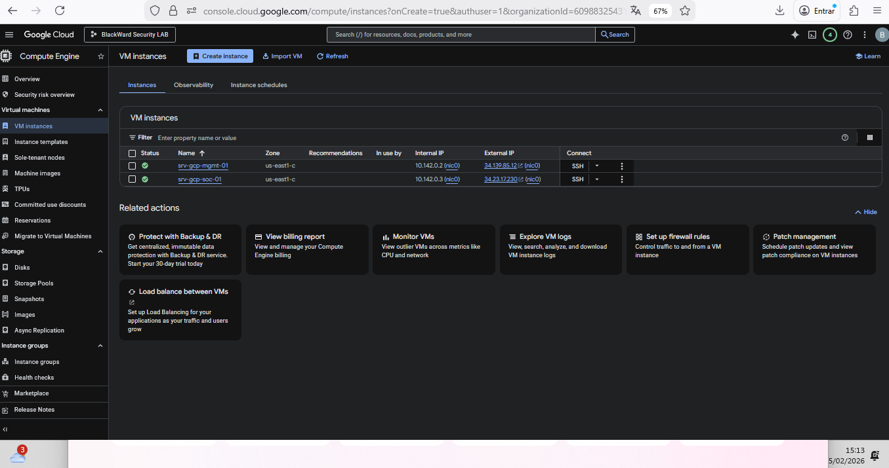
  ㅤㅤㅤㅤㅤㅤㅤㅤㅤㅤㅤㅤㅤㅤㅤㅤㅤㅤㅤㅤㅤㅤㅤㅤㅤㅤfigura 8: Instâncias criadas
 
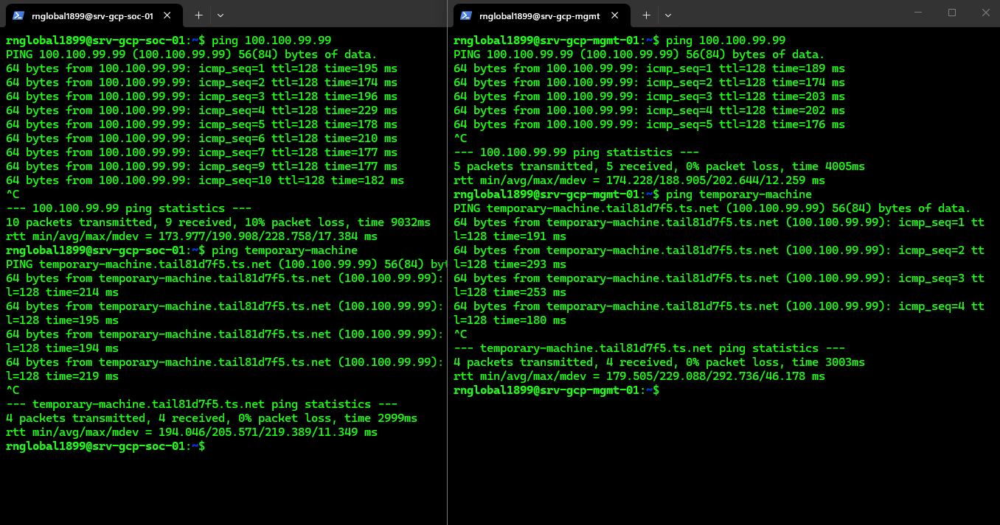
  ㅤㅤㅤㅤㅤㅤㅤㅤㅤㅤㅤㅤㅤㅤㅤㅤㅤㅤㅤㅤㅤㅤㅤㅤㅤㅤfigura 8: Teste de conectividade

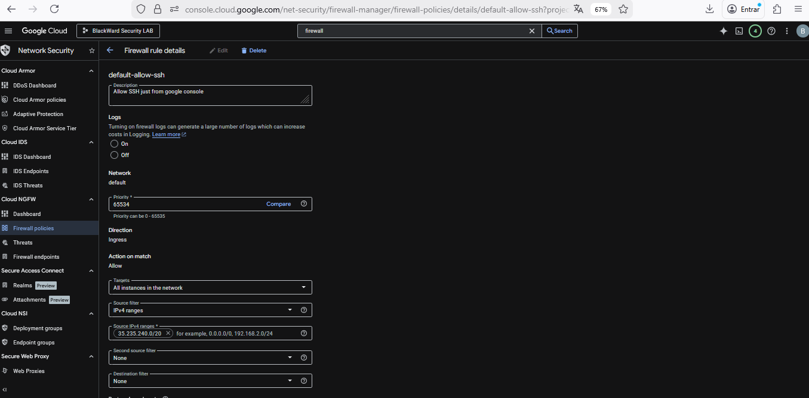
  ㅤㅤㅤㅤㅤㅤㅤㅤㅤㅤㅤㅤㅤㅤㅤㅤㅤㅤㅤㅤㅤㅤㅤㅤㅤㅤfigura 8: ssh_bloqueado
 
---
 
## **4.2 O Desafio do Acesso Gráfico em Ambientes Headless**
 
Embora as máquinas sejam servidores Linux geridos majoritariamente via CLI, a operação do laboratório exigiu a instalação de uma interface gráfica (GUI) gerenciada via RustDesk. O processo foi aplicado de forma idêntica em ambas as máquinas.
 
### **Script de Provisionamento: Interface Gráfica + RustDesk**
 
O script abaixo instalou o ambiente XFCE4, configurou o LightDM como display manager padrão, instalou o RustDesk e liberou a porta de acesso direto no UFW:
 
```bash
#!/bin/bash
RUSTDESK_PASS="blackward@2026"
 
echo "1. Atualizando repositórios do Ubuntu..."
sudo apt update -y
 
echo "2. Instalando Interface Gráfica (XFCE4) e Gerenciador de Tela (LightDM)..."
sudo DEBIAN_FRONTEND=noninteractive apt install -y xfce4 xfce4-goodies lightdm wget ufw
 
echo "3. Configurando o LightDM como gerenciador de inicialização padrão..."
echo "/usr/sbin/lightdm" | sudo tee /etc/X11/default-display-manager
sudo systemctl enable lightdm
 
echo "4. Baixando e instalando o RustDesk..."
wget -qO rustdesk.deb "https://github.com/rustdesk/rustdesk/releases/download/1.3.1/rustdesk-1.3.1-x86_64.deb"
sudo apt install -y ./rustdesk.deb
rm rustdesk.deb
 
echo "5. Liberando a porta 21118 no Firewall Interno (UFW)..."
sudo ufw allow 21118/tcp
 
echo "6. Habilitando serviços..."
sudo systemctl enable rustdesk
 
echo "7. Injetando senha permanente do RustDesk..."
sudo systemctl start rustdesk
sleep 5
sudo rustdesk --password "$RUSTDESK_PASS"
 
echo "=========================================================="
echo "   INSTALAÇÃO CONCLUÍDA! UMA REINICIALIZAÇÃO É NECESSÁRIA "
echo "=========================================================="
```
 
### **Análise de Causa Raiz (RCA): A Ilusão do Servidor X11**
 
Após a execução do script, todas as tentativas de conexão via RustDesk retornavam `"Connection refused"`. O diagnóstico revelou a causa raiz: instâncias de nuvem são 100% *headless* — não possuem GPU física nem saída de vídeo. O servidor X11 do Ubuntu tenta detectar o hardware durante o boot; ao falhar, ele aborta a renderização da interface. Sem um display rodando em background, o RustDesk não tem o que capturar e derruba a conexão imediatamente.
 
Tentativas intermediárias que **não resolveram**:
- Reiniciar a VM e o serviço do RustDesk (`systemctl restart rustdesk`)
- Instalar apenas o pacote `xserver-xorg-video-dummy` sem configuração de Xorg
### **Resolução Cirúrgica: Injeção de Monitor Virtual**
 
Para forçar o Ubuntu a renderizar a interface, foi criado um arquivo de configuração estático em `/etc/X11/xorg.conf` utilizando o driver de vídeo virtual `dummy`. O script injetou as seções `Device`, `Monitor` e `Screen`, forçando o sistema a acreditar na existência de um monitor fixo com resolução de 1920x1080:
 
```bash
sudo bash -c 'cat > /etc/X11/xorg.conf << EOF
Section "Device"
    Identifier  "Configured Video Device"
    Driver      "dummy"
EndSection
 
Section "Monitor"
    Identifier  "Configured Monitor"
    HorizSync   31.5-48.5
    VertRefresh 50-70
EndSection
 
Section "Screen"
    Identifier  "Default Screen"
    Monitor     "Configured Monitor"
    Device      "Configured Video Device"
    DefaultDepth 24
    SubSection "Display"
        Depth   24
        Modes   "1920x1080"
    EndSubSection
EndSection
EOF'
 
sudo systemctl restart lightdm
sudo systemctl restart rustdesk
```
 
Após a reinicialização dos serviços, a conexão foi estabelecida com sucesso.
 
 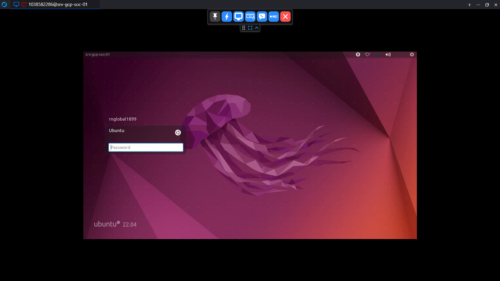
  ㅤㅤㅤㅤㅤㅤㅤㅤㅤㅤㅤㅤㅤㅤㅤㅤㅤㅤㅤㅤㅤㅤㅤㅤㅤㅤfigura 8: Acesso RustDesk (SOC)


  ㅤㅤㅤㅤㅤㅤㅤㅤㅤㅤㅤㅤㅤㅤㅤㅤㅤㅤㅤㅤㅤㅤㅤㅤㅤㅤfigura 8: Acesso RustDesk (MGMT)

### **Decisão de Design: Migração XFCE4 → GNOME**
 
Posteriormente, por decisão de design do ambiente, o XFCE4 foi substituído pelo ambiente GNOME padrão (`gdm3`) em ambas as instâncias. Foi estritamente necessário desabilitar o protocolo Wayland no arquivo `/etc/gdm3/custom.conf` para manter a compatibilidade de captura do RustDesk:
 
```ini
# /etc/gdm3/custom.conf
[daemon]
WaylandEnable=false
```
 
**Por que:** O RustDesk utiliza a API X11 para captura de tela. O Wayland, por design de segurança, isola os buffers de framebuffer entre aplicações — tornando a captura impossível sem extensões específicas. Desabilitá-lo força o GNOME a iniciar uma sessão X11 pura, restaurando a compatibilidade.
 
---
 
## **4.3 Integração Híbrida e Sobrescrita de Políticas da GCP (SSH)**
 
A etapa final consistiu em integrar o servidor de Management ao domínio `blackwardsecurity.xyz` e aplicar controle de acesso (RBAC) extremamente rígido, permitindo que **apenas** a conta `bruno.eduardo@blackwardsecurity.xyz` tivesse permissão de login via SSH.
 
### **Etapa 1 — Bypass de Resolução Kerberos (`/etc/hosts`)**
 
O servidor precisava resolver corretamente o nome do Domain Controller para que Kerberos e LDAP funcionassem. O DNS interno da GCP não conhece o espaço de nomes `blackwardsecurity.xyz`, resultando em falhas silenciosas no `realm lookup` e no `LDAP bind`.
 
```bash
# /etc/hosts — entrada injetada
100.100.10.20   AD-LOCAL-01.blackwardsecurity.xyz   blackwardsecurity.xyz   AD-LOCAL-01
```
 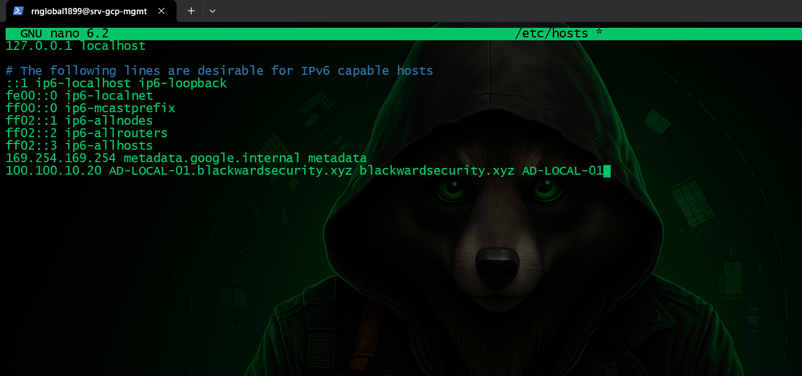
  ㅤㅤㅤㅤㅤㅤㅤㅤㅤㅤㅤㅤㅤㅤㅤㅤㅤㅤㅤㅤㅤㅤㅤㅤㅤㅤfigura 8: Arquivo host editado

### **Etapa 2 — Configuração Granular do SSSD**
 
O arquivo `/etc/sssd/sssd.conf` foi ajustado com dois objetivos: permitir login com nome curto e restringir o acesso a um único usuário do domínio.
 
```ini
# /etc/sssd/sssd.conf
[sssd]
domains = blackwardsecurity.xyz
 
[domain/blackwardsecurity.xyz]
id_provider = ad
ad_domain = blackwardsecurity.xyz
krb5_realm = BLACKWARDSECURITY.XYZ
ldap_id_mapping = True
fallback_homedir = /home/%u
default_shell = /bin/bash
cache_credentials = True
 
# Permite login com nome curto (bruno.eduardo em vez do UPN completo)
use_fully_qualified_names = False
 
# Restringe acesso exclusivamente ao usuário autorizado
access_provider = simple
simple_allow_users = bruno.eduardo
```
 
```bash
sudo systemctl restart sssd
```
  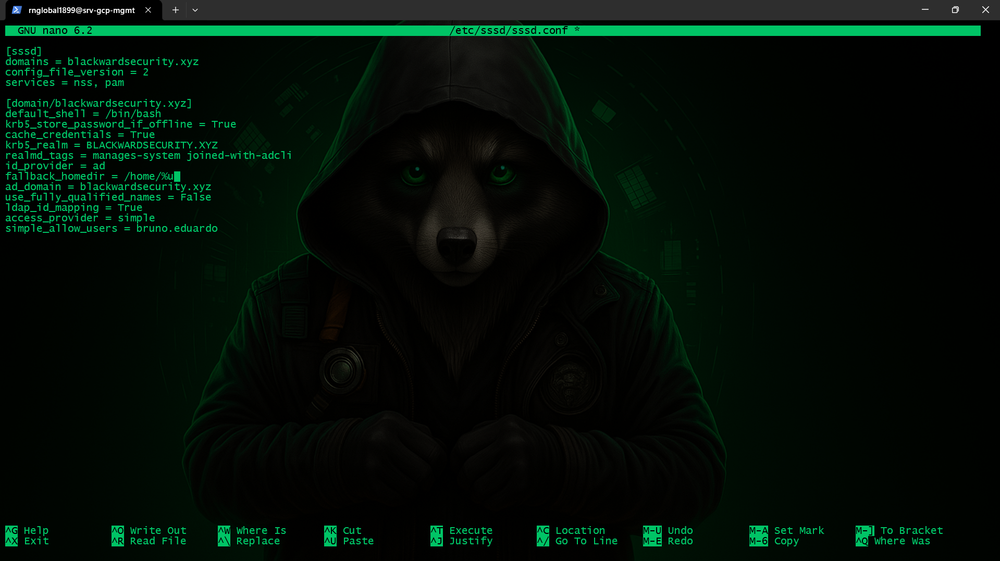
  ㅤㅤㅤㅤㅤㅤㅤㅤㅤㅤㅤㅤㅤㅤㅤㅤㅤㅤㅤㅤㅤㅤㅤㅤㅤㅤfigura 8: Desabilitando FQDN

### **Etapa 3 — Contornando Bloqueios Nativos da GCP**
 
> **Princípio Arquitetural: Entendendo a Hierarquia do `cloud-init`.** Imagens nativas da GCP são configuradas para bloquear autenticação por senha via SSH, priorizando chaves públicas. Simplesmente alterar o arquivo `/etc/ssh/sshd_config` não surte efeito, pois a GCP utiliza *drop-in files* que sobrescrevem a configuração primária durante o boot.
 
Para resolver isso, além de modificar o arquivo principal, foi obrigatório identificar e editar o arquivo específico de provisionamento em nuvem:
 
```bash
# Arquivo principal
# /etc/ssh/sshd_config
PasswordAuthentication yes
 
# Arquivo de override da GCP — este é o que realmente prevalece
# /etc/ssh/sshd_config.d/60-cloudimg-settings.conf
PasswordAuthentication yes
```
 
```bash
sudo systemctl restart ssh
```

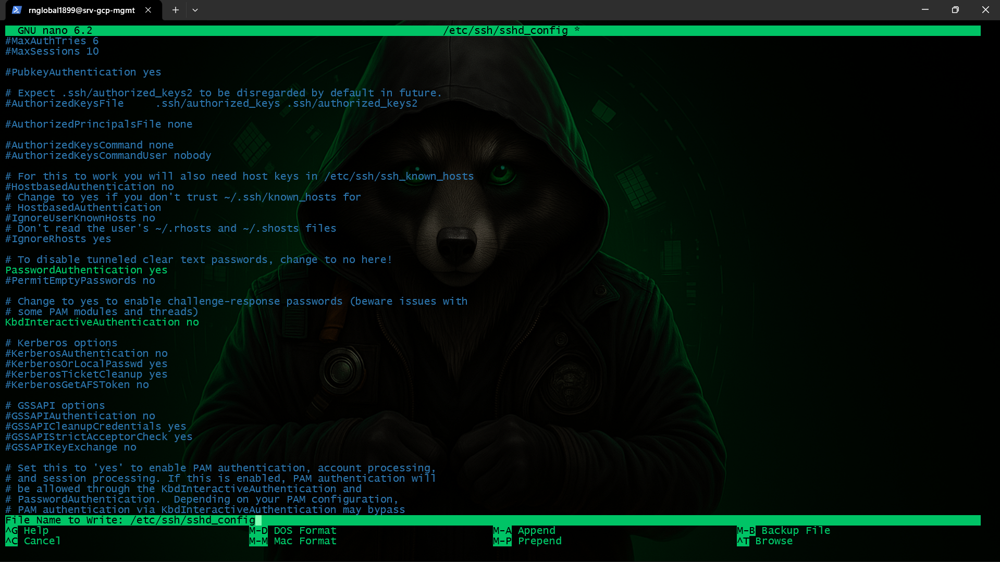
  ㅤㅤㅤㅤㅤㅤㅤㅤㅤㅤㅤㅤㅤㅤㅤㅤㅤㅤㅤㅤㅤㅤㅤㅤㅤㅤfigura 8: Permitindo ssh por senha

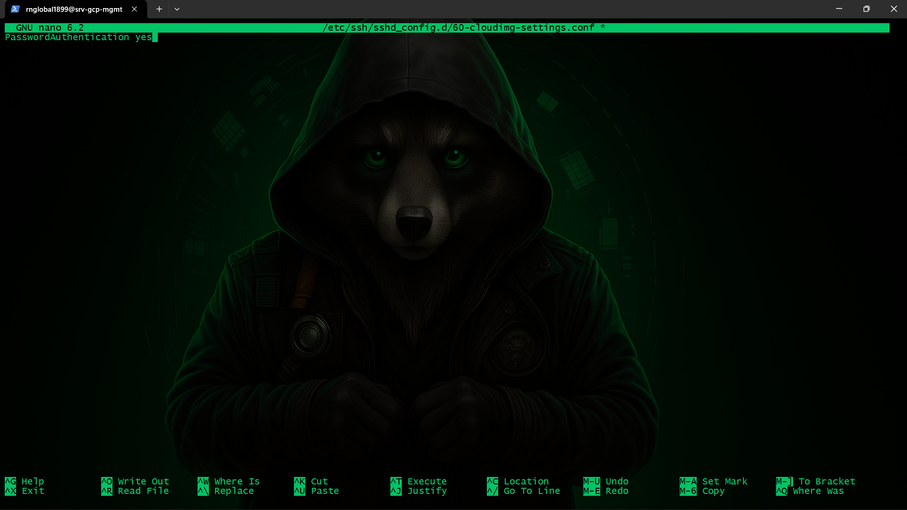
  ㅤㅤㅤㅤㅤㅤㅤㅤㅤㅤㅤㅤㅤㅤㅤㅤㅤㅤㅤㅤㅤㅤㅤㅤㅤㅤfigura 8: Editando arquivo padrão GCP

### **Etapa 4 — Trava Dupla de Acesso (SSSD + realmd)**
 
Para garantir camadas redundantes de controle de acesso, a restrição foi aplicada em dois níveis independentes — no daemon de autenticação (SSSD, configurado na Etapa 2) e na política de domínio via `realmd`:
 
```bash
# Remove permissão de acesso a todos os usuários do domínio
sudo realm deny --all
 
# Concede acesso explicitamente apenas ao usuário autorizado
sudo realm permit bruno.eduardo@blackwardsecurity.xyz
```
 
**Por que a trava dupla:** Se o SSSD for reconfigurado ou reiniciado com parâmetros padrão, a política do `realmd` continua ativa como segunda linha de defesa — e vice-versa. Isso elimina o risco de um único ponto de falha de configuração abrir acesso indevido ao servidor.
 
 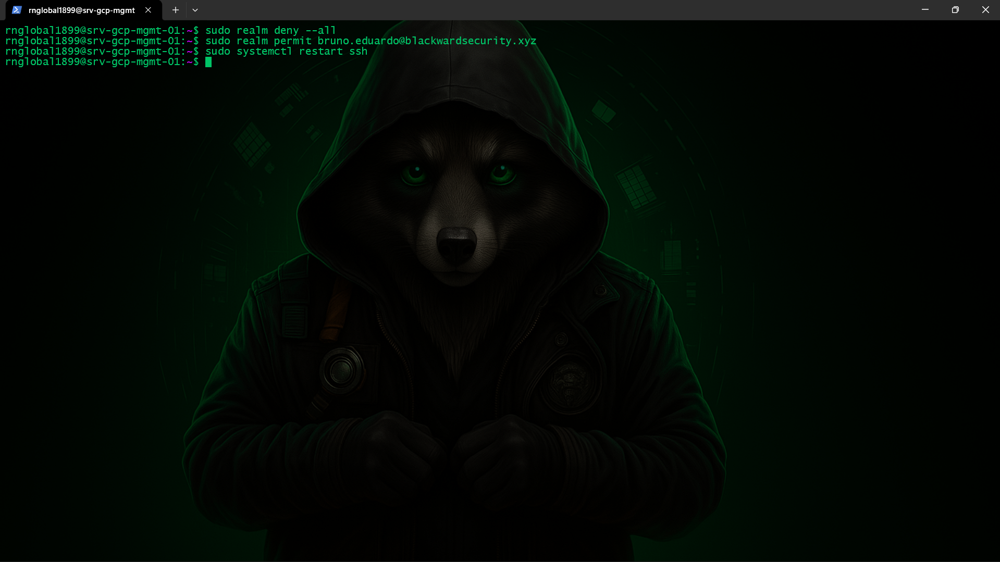
  ㅤㅤㅤㅤㅤㅤㅤㅤㅤㅤㅤㅤㅤㅤㅤㅤㅤㅤㅤㅤㅤㅤㅤㅤㅤㅤfigura 8: Permitindo apenas o usuário correto

  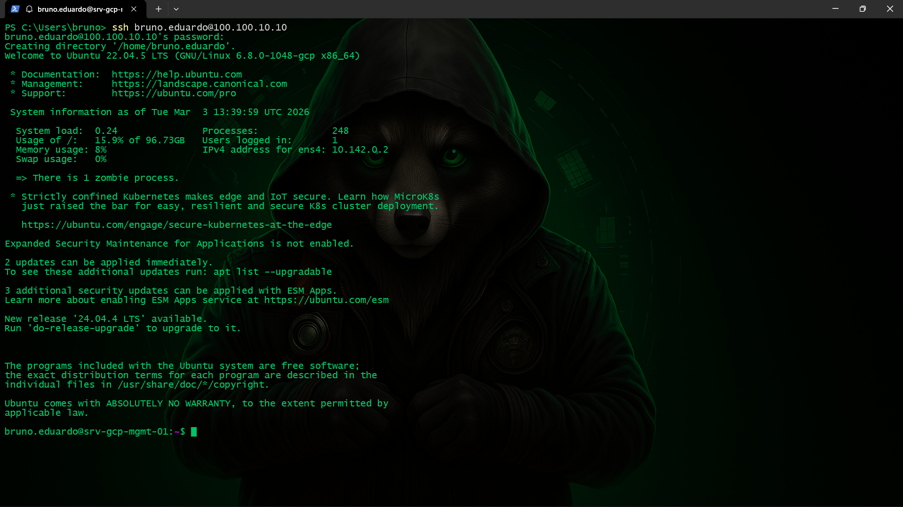
  ㅤㅤㅤㅤㅤㅤㅤㅤㅤㅤㅤㅤㅤㅤㅤㅤㅤㅤㅤㅤㅤㅤㅤㅤㅤㅤfigura 8: Conexão ssh com sucesso

  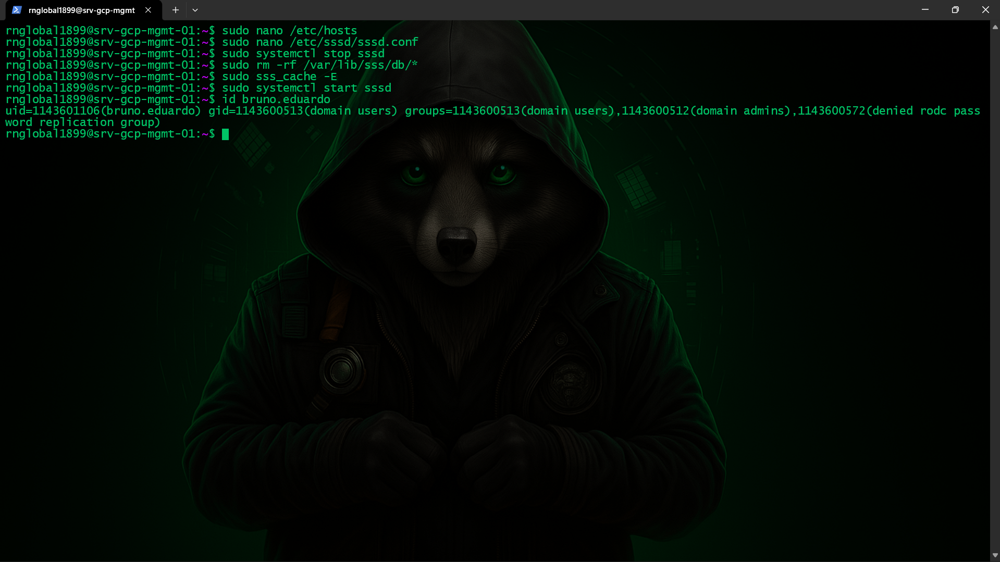
  ㅤㅤㅤㅤㅤㅤㅤㅤㅤㅤㅤㅤㅤㅤㅤㅤㅤㅤㅤㅤㅤㅤㅤㅤㅤㅤfigura 8: Id de usuário
  
---
 
## **4.4 Skills e Competências Adquiridas**
 
A consolidação deste módulo comprovou resiliência em diagnóstico e compreensão profunda do comportamento de sistemas operacionais em nuvem pública.
 
| **Área** | **Competência** |
|---|---|
| ☁️ **Cloud Compute (GCP)** | Provisionamento de infraestrutura escalável, gestão de instâncias e2-standard e compreensão da hierarquia de arquivos de configuração em nuvem (`cloudimg-settings` / drop-in files). |
| 🐧 **Linux Sysadmin Avançado** | Manipulação profunda de servidores gráficos (X11/Xorg), contornando limitações de hardware headless através da injeção de drivers `dummy` e desativação do Wayland. |
| 🪪 **IAM e Integração Híbrida** | Ajuste fino de parâmetros Kerberos e LDAP no daemon SSSD (`sssd.conf`) e aplicação de filtros granulares de negação e permissão utilizando o utilitário `realmd`. |
| 🔐 **Microssegmentação SSH** | Aplicação de Least Privilege em camada dupla independente (SSSD + realmd), garantindo uma superfície de ataque restrita apenas ao administrador autorizado do laboratório. |