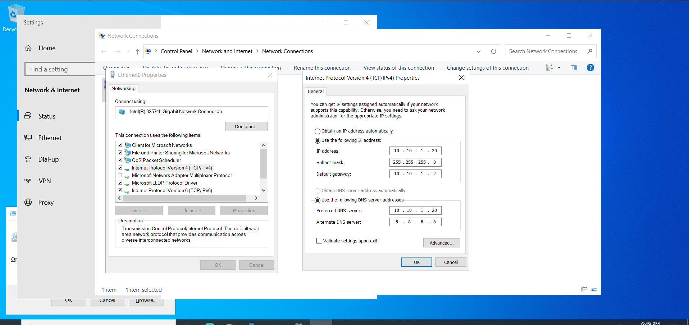
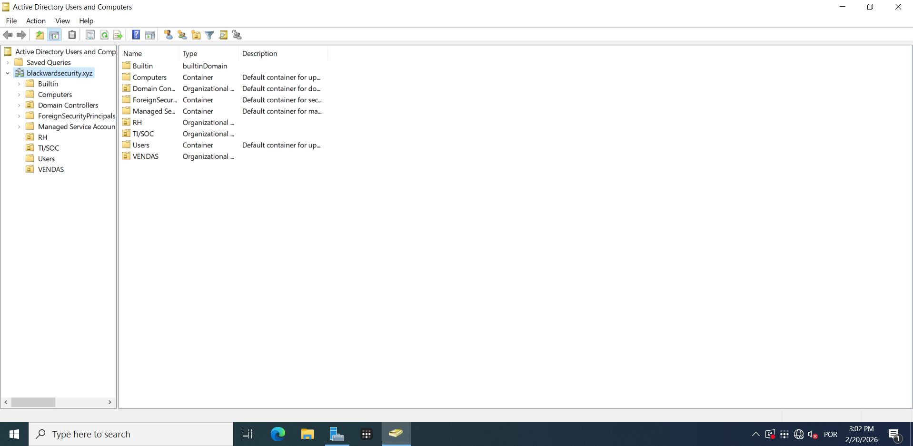
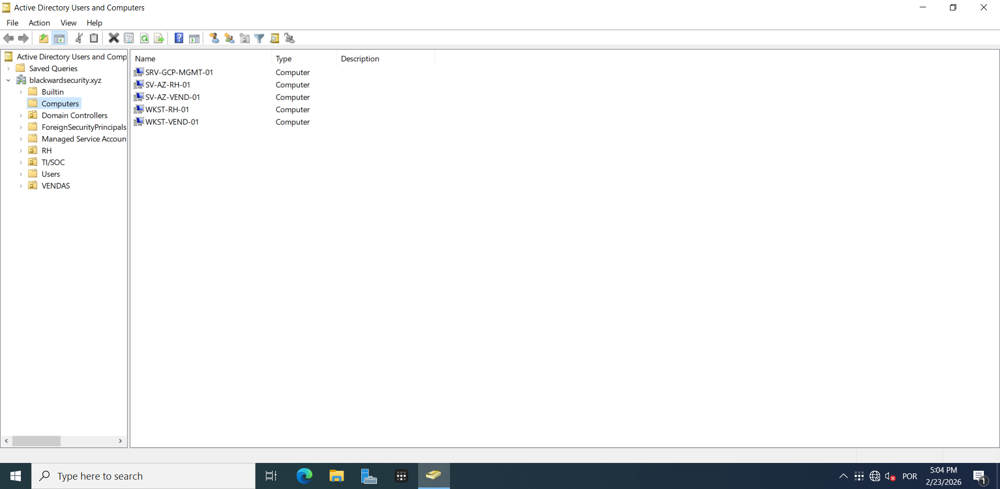
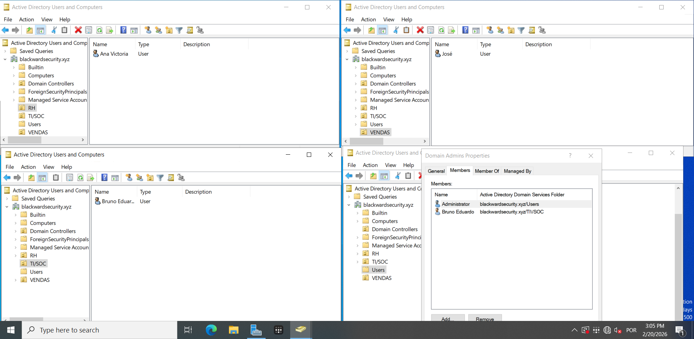

# BlackWard Security LAB — Documentação Técnica de Portfólio ###
### Módulo 1 — Âncora de Identidade On-Premises (AD DS)

`Windows Server 2022` `Active Directory` `Tailscale Zero Trust`

| | |
|---|---|
| **Analista Responsável** | Bruno Eduardo |
| **Última Atualização** | 15 de Abril de 2026 |

---

## 3.1 Provisionamento Local: Âncora de Identidade On-Premises

Este relatório detalha o processo de design, provisionamento e integração do controlador de domínio local que serve como raiz de confiança *(trust anchor)* de todo o ecossistema BlackWard Security LAB. A narrativa segue o modelo decisional adotado ao longo do projeto: **racional arquitetural → especificações técnicas → implementação → competências adquiridas**.

---

## 3.1.1 Racional de Dimensionamento e Arquitetura de Rede

### Decisão Estratégica: Controlador de Domínio Minimalista

A arquitetura do laboratório impõe uma restrição de hardware relevante: host físico com CPU Athlon 3000G (4 threads) e 8 GB de RAM total, compartilhados entre o hypervisor (VMware Workstation), o controlador de domínio local e a estação de trabalho do analista. Esse cenário forçou uma decisão de design deliberada: isolar o Active Directory Domain Services (AD DS) em uma VM com pegada mínima, operando estritamente como autoridade de autenticação e diretório — sem carregar roles desnecessárias como DNS recursivo público, DHCP de escopo amplo ou serviços de ficheiros.

Essa escolha não é apenas uma concessão ao hardware: ela reflete uma boa prática de hardening. Em ambientes produtivos, o Domain Controller não deve executar serviços concorrentes, pois cada serviço adicional amplia a superfície de ataque do ativo mais crítico da rede.

> **Princípio Arquitetural:** Separação de funções *(Separation of Duties)* aplicada à infraestrutura: o DC é soberano de identidade, não servidor de propósito geral. Cargas pesadas (SIEM, gestão) são deliberadamente descarregadas para nuvem (GCP), conforme estratégia de Cloud Offloading do laboratório.

### Decisão de Rede: NAT Isolado com Endereçamento Estático

Para garantir total previsibilidade de roteamento antes da camada SD-WAN, a VM foi conectada a um vSwitch VMnet8 em modo NAT, com o serviço de DHCP nativo do VMware desativado na sub-rede. A razão é técnica e crítica: um servidor DNS que também é DC não pode ter seu endereço IP alterado sem quebrar o registro SRV do Kerberos (`_kerberos._tcp.<domínio>`) e a delegação de zona DNS interna. Endereçamento estático é, portanto, um pré-requisito funcional, não uma preferência.

| Parâmetro | Valor / Decisão |
|---|---|
| **Hypervisor** | VMware Workstation (vSwitch VMnet8 — NAT) |
| **Sub-rede** | 10.10.1.0/24 |
| **DHCP** | Desativado (controle manual total de endereçamento) |
| **IP Estático (DC)** | 10.10.1.20 |
| **Gateway Padrão** | 10.10.1.2 (gateway padrão VMware NAT) |
| **DNS Primário** | 10.10.1.20 (auto-referência — DC é autoridade DNS) |


ㅤㅤㅤㅤㅤㅤㅤㅤㅤㅤㅤㅤㅤㅤㅤㅤㅤㅤㅤㅤㅤㅤㅤㅤㅤㅤㅤㅤㅤㅤfigura 1: IP configurado

---

## 3.1.2 Especificações da VM e Configuração Base

O provisionamento da máquina virtual seguiu critérios de eficiência de recursos, mantendo o mínimo necessário para estabilidade do AD DS em cenários com baixa carga de autenticação (ambiente de laboratório, dezenas de objetos).

| Parâmetro | Valor / Decisão |
|---|---|
| **Sistema Operacional** | Windows Server 2022 |
| **vCPUs alocadas** | 2 (do pool de 4 threads do Athlon 3000G) |
| **RAM** | 3 GB |
| **Armazenamento** | 60 GB (disco único — SO + banco NTDS) |
| **Hostname** | AD-LOCAL-01 (padrão: função-localização-índice) |
| **Interface de Rede** | VMnet8 (NAT) — IP 10.10.1.20/24 |

### Configuração de Perímetro (Windows Defender Firewall)

Para viabilizar testes de conectividade e a futura integração com nós na GCP e Azure via túnel Tailscale, foram habilitadas as regras de ICMPv4 no Windows Defender Firewall. A decisão foi escopo-limitada: apenas Echo Request (inbound e outbound) foi liberado. Nenhuma porta de administração (RDP 3389, WinRM 5985/5986) foi exposta neste estágio.

- Regras habilitadas: *"Compartilhamento de Arquivos e Impressoras (Solicitação de Eco — ICMPv4-In)"* e *"ICMPv4-Out"*.
- Finalidade operacional: validação de alcançabilidade *(reachability)* entre o DC local e as instâncias de nuvem sem depender de ferramentas adicionais.

---

## 3.1.3 Conectividade Híbrida Zero Trust via Tailscale (SD-WAN)

O desafio central da integração on-premises em um ambiente doméstico é a presença de NAT duplo (ISP → roteador doméstico → VMware NAT) e a ausência de IP público estático. Abordagens tradicionais como Port Forwarding exporiam portas sensíveis do DC (LDAP 389, Kerberos 88, SMB 445) à internet pública — um risco inaceitável mesmo em ambiente de laboratório.

A solução adotada foi implementar uma malha SD-WAN via Tailscale, que encapsula o tráfego em túneis WireGuard ponto-a-ponto. A escolha do WireGuard como protocolo subjacente é relevante do ponto de vista de segurança: sua base de código reduzida (~4.000 linhas, em contraste com ~600.000 do OpenVPN) resulta em superfície de ataque menor e auditabilidade superior. O Tailscale atua como plano de controle gerenciado (DERP relay + coordination server), eliminando a necessidade de servidor VPN dedicado.

> **Fluxo de Integração:** O agente Tailscale foi instalado no Windows Server e autenticado via conta centralizada de administrador do laboratório. O nó foi incorporado à rede mesh privada e recebeu o IP imutável `100.100.10.20` (espaço de endereçamento CGNAT 100.x.y.z do Tailscale), garantindo roteabilidade direta para instâncias na GCP e na Azure sem qualquer exposição de porta ao plano público.

```
IP Tailscale do DC : 100.100.10.20
Alcançável por     : srv-gcp-mgmt-01, srv-gcp-soc-01, sv-az-rh-01, sv-az-vendas-01, wkst-vend-01, wkst-rh-01.
Protocolo de túnel : WireGuard (UDP — porta 41641 por padrão)
MagicDNS           : ad-local-01.tail<hash>.ts.net
```

---

## 3.1.4 Promoção a Domain Controller e Design do Diretório

### Espaço de Nomes e Promoção (dcpromo)

Com a rede estabilizada, o servidor foi promovido a Domain Controller de uma nova floresta Active Directory. A escolha do nome de domínio reflete uma prática recomendada: utilizar um domínio DNS registrado e sob controle do laboratório para evitar colisão de namespaces em cenários de integração com nuvem (Azure AD Connect / Microsoft Entra ID exige que o domínio local seja verificável).

| Parâmetro | Valor / Decisão |
|---|---|
| **FQDN do Domínio** | blackwardsecurity.xyz |
| **Nível Funcional** | Windows Server 2016 (compatibilidade com Azure AD Connect) |
| **Papel (Role)** | AD DS + DNS Server (integrado ao domínio) |
| **Servidor de Catálogo Global** | Sim (único DC na floresta) |

### Hierarquia Organizacional (OUs) — Design para RBAC

A estrutura de Unidades Organizacionais foi projetada para refletir a segmentação departamental do ambiente corporativo simulado, com vista à aplicação futura de Políticas de Grupo (GPOs) diferenciadas por setor e à implementação de Controle de Acesso Baseado em Função (RBAC). A granularidade no design do AD desde o início evita reestruturações custosas quando o ambiente escala.

- **TI/SOC** — Contas privilegiadas dos analistas. Receberão GPOs de hardening (auditoria ampliada, restrições de execução de processos, integração com Elastic Agent).
- **RH** — Contas com acesso a servidores de arquivos sensitivos na Azure. Alvo futuro de honeyfiles e monitoramento de DLP (Data Loss Prevention).
- **VENDAS** — Contas com menor privilégio. Segmento isolado via ACLs no Tailscale, sem acesso ao segmento de Gestão na GCP.

| OU | Usuário Provisionado |
|---|---|
| **TI/SOC** | Bruno Eduardo · Conta de Administrador do Laboratório |
| **RH** | Victoria · Usuária de teste para simulações de acesso a dados sensíveis |
| **VENDAS** | José · Usuário de teste para simulações de segmentação e controle de acesso |

A separação em OUs também é o pré-requisito para o Módulo 3 (SOC/Blue Team): o Elastic Agent implantado no DC captura eventos de autenticação e mudanças de diretório por OU, permitindo a criação de alertas direcionados no Kibana — por exemplo, qualquer tentativa de login de uma conta do OU VENDAS em uma estação do OU TI/SOC.


ㅤㅤㅤㅤㅤㅤㅤㅤㅤㅤㅤㅤㅤㅤㅤㅤㅤㅤㅤㅤㅤㅤㅤㅤㅤㅤㅤㅤㅤㅤfigura 2: Pastas do AD


ㅤㅤㅤㅤㅤㅤㅤㅤㅤㅤㅤㅤㅤㅤㅤㅤㅤㅤㅤㅤㅤㅤㅤㅤㅤㅤㅤㅤㅤㅤfigura 3: Máquinas ingressadas


ㅤㅤㅤㅤㅤㅤㅤㅤㅤㅤㅤㅤㅤㅤㅤㅤㅤㅤㅤㅤㅤㅤㅤㅤㅤㅤㅤㅤㅤㅤfigura 4: Usuários

---

## 3.1.5 Skills e Competências Adquiridas

As competências abaixo foram desenvolvidas e validadas durante a execução desta fase do laboratório, com foco em sua aplicabilidade em ambientes corporativos reais.

| Área | Competência |
|---|---|
| ⚙️ **Virtualização e vNetworking** | Comportamento de vSwitches VMware (VMnet1/VMnet8), controle de DHCP por sub-rede virtual, impacto de modo NAT vs. Bridge em serviços de diretório. |
| 🖥️ **Administração Windows Server** | Promoção de Domain Controllers (dcpromo / Server Manager), gestão de AD DS (ADUC), criação e delegação de OUs, provisionamento de objetos de usuário com atributos padronizados. |
| 🔐 **Segurança de Identidade** | Entendimento prático de como Kerberos, LDAP e DNS são interdependentes no AD DS; princípio de menor superfície de ataque aplicado ao DC (separação de roles). |
| 🌐 **Conectividade SD-WAN / Zero Trust** | Implementação prática de rede mesh WireGuard via Tailscale, compreensão do modelo Zero Trust Network Access (ZTNA): autenticação por dispositivo/identidade em vez de perímetro de rede. |
| ☁️ **Integração Híbrida** | Arquitetura de "spoke" local consumindo serviços de "hub" em nuvem; preparação do namespace AD para sincronização futura com Microsoft Entra ID (Azure AD Connect). |
