# **3.3 Provisionamento e Integração Híbrida: Servidores Windows na Azure (RH e Vendas)**
 
`Azure IaaS` `Cloud FinOps` `PowerShell Automation` `Windows Server 2022` `RustDesk`
 
| | |
|---|---|
| **Analista Responsável** | Bruno Eduardo |
| **Última Atualização** | 16 de Abril de 2026 |
 
---
 
Este relatório documenta a expansão da infraestrutura simulada para a Microsoft Azure. Nessa etapa foi feito o provisionamento de dois servidores baseados em Windows Server 2022 (Azure Edition) atuando como endpoints departamentais (RH e Vendas), garantindo governança de custos (FinOps), gestão remota segura sem exposição pública e troubleshooting complexo de roteamento e DNS em um ambiente multicloud integrado via malha Zero Trust. Além disso, posteriormente, foi feita a sincronização do Active Directory local (AD-LOCAL-01) com a nuvem da Microsoft (Entra ID), adotando o domínio oficial blackwardsecurity.xyz. O foco arquitetural foi duplo: criar uma superfície de ataque realista para o laboratório (Red Team) e habilitar a telemetria de nuvem para caça a ameaças (Blue Team), mantendo controle cirúrgico sobre quais objetos locais são expostos à internet.
 
---
 
## **3.3.1 Gestão de Custos e Automação (Cloud FinOps)**
 
### **Decisão Estratégica: Proteção contra Faturamento Excedente**
 
Antes de alocar qualquer recurso computacional, foi imperativo projetar uma barreira de proteção financeira. Em ambientes de laboratório baseados em nuvem pública, o esquecimento de instâncias ligadas é a principal causa de consumo acidental de créditos.
 
Para mitigar isso, estruturei o grupo de recursos `Blackward_Security_Automation` focado puramente em governança:
 
- **Controle de Orçamento:** Criei o orçamento `BlackWard_Orcamento_LAB` com limite rígido de R$80 mensais e configurei gatilhos de alerta preventivos nas faixas de R$40, R$72 e R$80.
- **Registro de Namespace:** Para habilitar as métricas de orçamento na assinatura, foi necessário registrar o provedor via PowerShell antes de prosseguir com a criação do Action Group:
```powershell
Register-AzResourceProvider -ProviderNamespace "microsoft.insights"
```
 
- **Automação de Desligamento:** Criei uma Conta de Automação com permissão de "Colaborador da máquina virtual" em nível de assinatura. Desenvolvi um Runbook (`Global_shutdown_budget`) integrado a um Action Group (`BlackWard_Shutdown`) para disparar o encerramento automático dos recursos em caso de violação do orçamento.
- **Desligamento Agendado:** Adicionalmente, as VMs foram configuradas nativamente para desligamento diário automático às 22:00 (Horário de Brasília).
---
 
 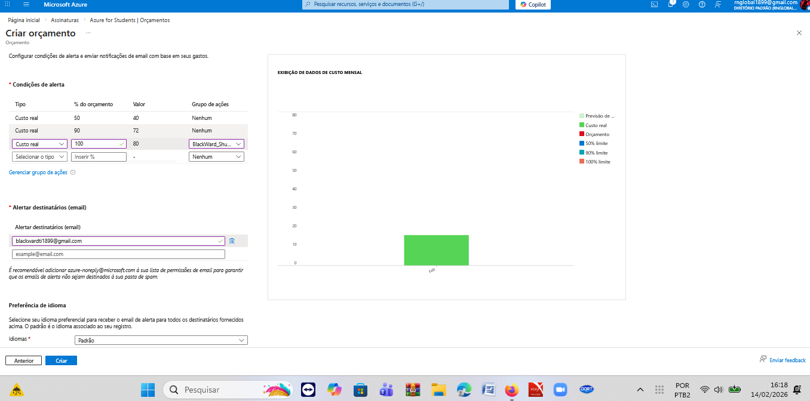
 ㅤㅤㅤㅤㅤㅤㅤㅤㅤㅤㅤㅤㅤㅤㅤㅤㅤㅤㅤㅤㅤㅤㅤㅤㅤㅤfigura 1: Orçamento criado

 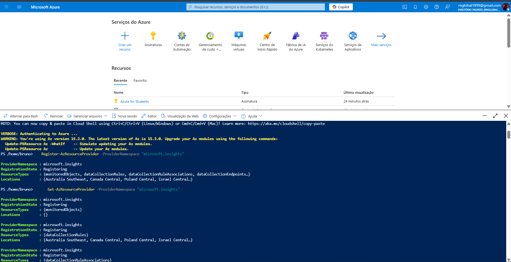
 ㅤㅤㅤㅤㅤㅤㅤㅤㅤㅤㅤㅤㅤㅤㅤㅤㅤㅤㅤㅤㅤㅤㅤㅤㅤㅤfigura 2: Registro de namespace via CLI

 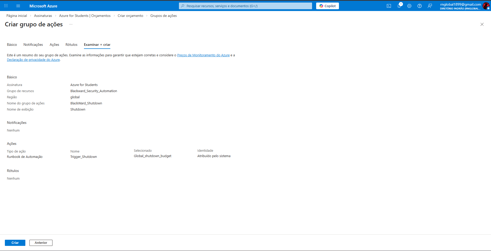
 ㅤㅤㅤㅤㅤㅤㅤㅤㅤㅤㅤㅤㅤㅤㅤㅤㅤㅤㅤㅤㅤㅤㅤㅤㅤㅤfigura 3: Grupo de ações criado

## **3.3.2 Arquitetura de Rede e Provisionamento de Compute**
 
### **Topologia da Rede Virtual (VNET-AZ-CORE-01)**
 
A topologia da rede virtual foi estruturada para segmentar logicamente os papéis de cada camada da infraestrutura Azure, com os servidores Windows alocados em uma sub-rede dedicada separada da camada de gestão.
 
| Sub-rede | Intervalo de IPs | Máscara | Endereços | Função |
|---|---|---|---|---|
| Subnet-10-MGMT | 10.10.2.0 – 10.10.2.63 | /26 | 64 | Gestão e monitoramento |
| Subnet-40-SV | 10.10.2.64 – 10.10.2.127 | /26 | 64 | Servidores departamentais |
 
> **Decisão de Região:** Devido à indisponibilidade de instâncias do tipo B-series na região East US, o laboratório foi estrategicamente provisionado na região **Canada Central**, mantendo latência adequada sem comprometer o orçamento.
 
### **Especificações das VMs**
 
| Parâmetro | Servidor RH (SV-AZ-RH-01) | Servidor Vendas (SV-AZ-VEND-01) |
|---|---|---|
| **Sistema Operacional** | Windows Server 2022 Datacenter: Azure Edition (Gen2) | Windows Server 2022 Datacenter: Azure Edition (Gen2) |
| **SKU / Tamanho** | Standard_B2ls_v2 (2 vCPUs, 4GiB RAM) | Standard_B2ls_v2 (2 vCPUs, 4GiB RAM) |
| **Armazenamento** | 64GB SSD Standard (Otimização de custo) | 64GB SSD Standard (Otimização de custo) |
| **Endereçamento (Privado)** | 10.10.2.68 | 10.10.2.69 |
| **Superfície Pública** | Nenhuma porta de entrada pública | Nenhuma porta de entrada pública |
 
  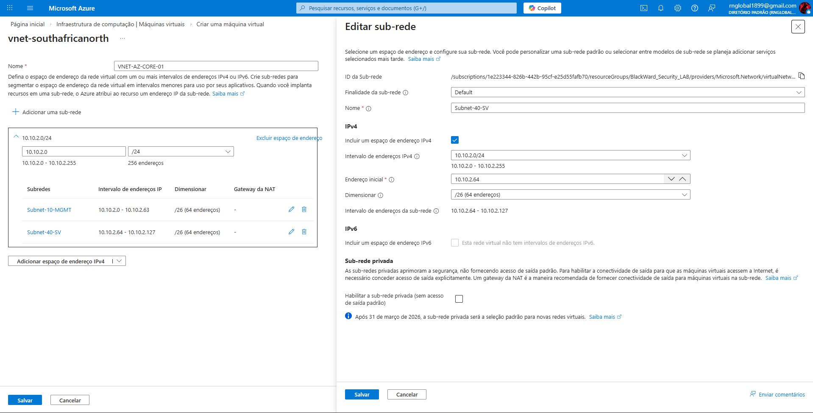
 ㅤㅤㅤㅤㅤㅤㅤㅤㅤㅤㅤㅤㅤㅤㅤㅤㅤㅤㅤㅤㅤㅤㅤㅤㅤㅤfigura 4: Rede virtual criada

  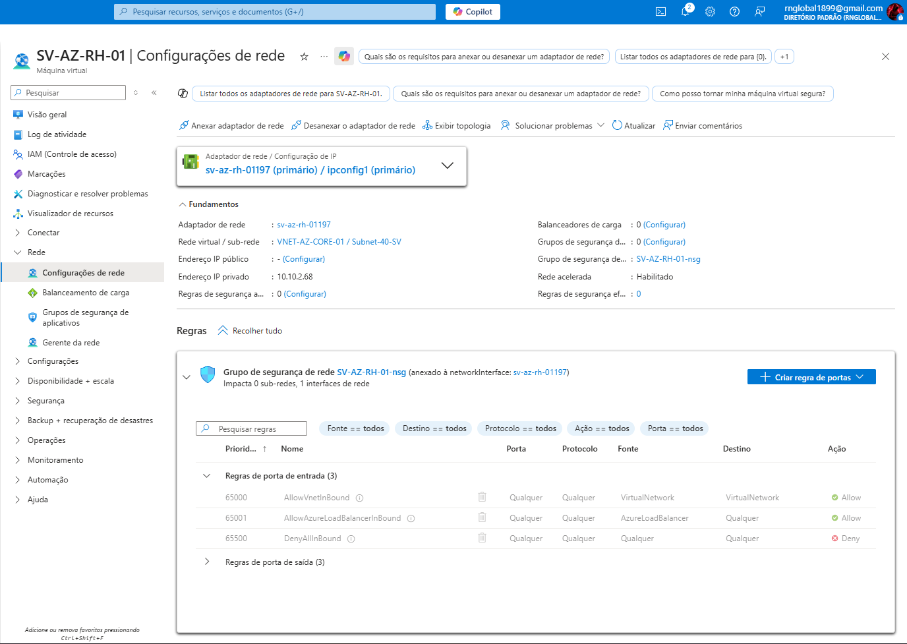
 ㅤㅤㅤㅤㅤㅤㅤㅤㅤㅤㅤㅤㅤㅤㅤㅤㅤㅤㅤㅤㅤㅤㅤㅤㅤㅤfigura 5: Configuração de rede (1)

  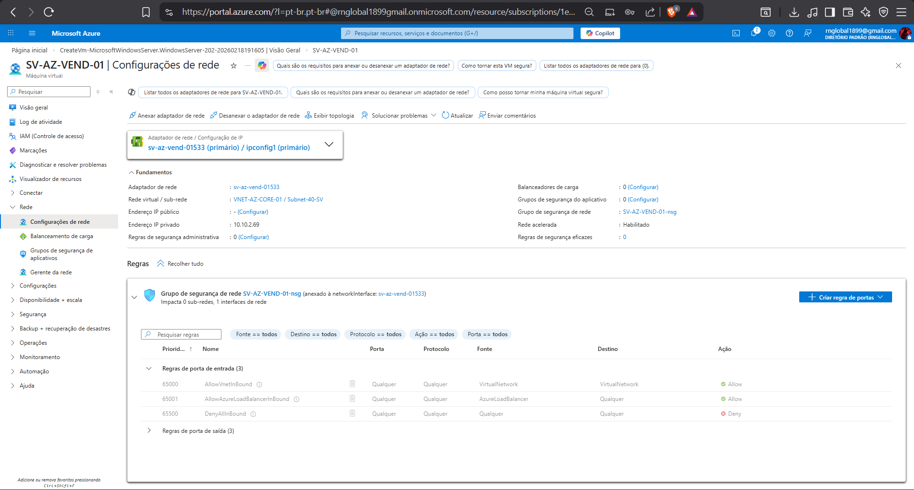
 ㅤㅤㅤㅤㅤㅤㅤㅤㅤㅤㅤㅤㅤㅤㅤㅤㅤㅤㅤㅤㅤㅤㅤㅤㅤㅤfigura 6: Configuração de rede (2)

---
 
## **3.3.3 Conectividade de Gerenciamento: Tailscale + RustDesk**
 
> **Princípio Arquitetural:** Administração Out-of-Band (OOB) Segura. Expor a porta 3389 (RDP) à internet é uma violação crítica. Alternativas nativas como o Azure Bastion geram custos elevados incompatíveis com o orçamento do laboratório.
 
Os servidores foram ingressados na malha SD-WAN do Tailscale, recebendo os IPs roteáveis `100.100.40.5` (RH) e `100.100.40.6` (Vendas). No entanto, o protocolo RDP nativo do Windows apresentou instabilidade severa sob a rede overlay, não funcionando mesmo após tentativas de ajuste de MTU e forçamento de túneis TCP via scripts.
 
**Solução — Remote Desktop Alternativo (RustDesk):** Para escalar o processo sem interação gráfica, desenvolvi um script em PowerShell que utiliza o gerenciador de pacotes Chocolatey para instalar a aplicação silenciosamente, injetar a senha de administração via CLI, iniciar o serviço em background e criar a regra de firewall liberando a porta `21118/TCP` para acesso direto dentro da malha Tailscale.
 
```powershell
# --- Script de Provisionamento Headless do RustDesk ---
$Password = "blackward@2026"
 
Write-Host "1. Preparando ambiente e instalando Chocolatey..."
Set-ExecutionPolicy Bypass -Scope Process -Force
[System.Net.ServicePointManager]::SecurityProtocol = [System.Net.ServicePointManager]::SecurityProtocol -bor 3072
Invoke-Expression ((New-Object System.Net.WebClient).DownloadString('https://community.chocolatey.org/install.ps1'))
 
Write-Host "2. Baixando e Instalando RustDesk (Silencioso)..."
C:\ProgramData\chocolatey\bin\choco.exe install rustdesk -y
 
Write-Host "3. Aguardando a inicialização do serviço em background..."
Start-Sleep -Seconds 10
Start-Service "RustDesk" -ErrorAction SilentlyContinue
 
Write-Host "4. Configurando Senha Permanente..."
$ExePath = "C:\Program Files\RustDesk\rustdesk.exe"
if (Test-Path $ExePath) {
    & $ExePath --password $Password
} else {
    Write-Host "ERRO: RustDesk não encontrado no caminho padrão."
}
 
Write-Host "5. Liberando porta 21118 no Firewall do Windows..."
New-NetFirewallRule -DisplayName "RustDesk Direct IP" -Direction Inbound -LocalPort 21118 -Protocol TCP -Action Allow -ErrorAction SilentlyContinue
 
Write-Host "6. Capturando o ID de acesso..."
Start-Sleep -Seconds 3
if (Test-Path $ExePath) {
    $RustDeskID = & $ExePath --get-id
    Write-Host "=========================================="
    Write-Host "   RUSTDESK INSTALADO COM SUCESSO!"
    Write-Host "   Seu ID: $RustDeskID"
    Write-Host "   Sua Senha: $Password"
    Write-Host "=========================================="
}
```
  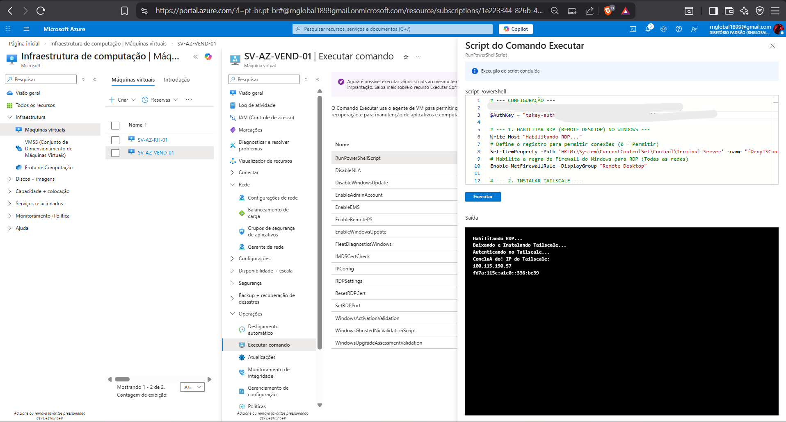
 ㅤㅤㅤㅤㅤㅤㅤㅤㅤㅤㅤㅤㅤㅤㅤㅤㅤㅤㅤㅤㅤㅤㅤㅤㅤㅤfigura 7: RDP e taiscale configurados

   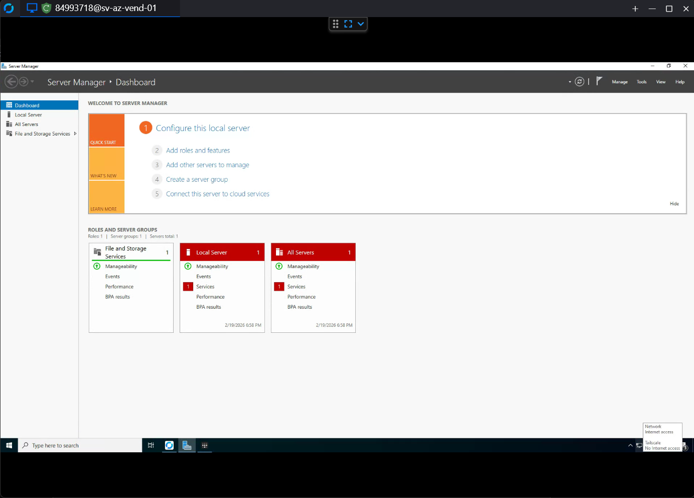
 ㅤㅤㅤㅤㅤㅤㅤㅤㅤㅤㅤㅤㅤㅤㅤㅤㅤㅤㅤㅤㅤㅤㅤㅤㅤㅤfigura 8: acesso via rustdesk com sucesso

---
 
## **3.3.4 Troubleshooting Híbrido: Ingresso de Domínio**
 
O ingresso dessas máquinas na floresta `blackwardsecurity.xyz` apresentou dois cenários distintos de falhas de rede e resolução de nomes, exigindo abordagens técnicas diferentes para cada servidor.
 
### **Cenário A: Máquina de Vendas (SV-AZ-VEND-01)**
 
A integração falhou inicialmente porque a VM estava herdando o DNS padrão da Azure, incapaz de localizar o controlador de domínio local.
 
- **Ajuste de DNS:** Modifiquei o apontamento DNS primário da máquina para o IP do DC na malha Tailscale (`100.100.10.20`) e configurei o nameserver via Tailscale MagicDNS.
- **Bloqueio de Perímetro:** A máquina conseguia localizar o AD, mas o tráfego ICMP (ping) falhava bilateralmente.
- **Resolução:** Utilizei PowerShell para forçar a interface de rede virtual do Tailscale a adotar o perfil de rede "Privada" e criei uma regra de firewall específica autorizando pacotes Echo Request vindos da sub-rede `100.64.0.0/10` do Tailscale.
```powershell
# --- Script de Correção de Rede Tailscale (SV-AZ-VEND-01) ---
Write-Host "1. Liberando Ping (ICMPv4) no Firewall Interno..."
New-NetFirewallRule -DisplayName "Permitir Ping Tailscale" -Direction Inbound -Action Allow -Protocol ICMPv4 -IcmpType 8 -RemoteAddress 100.64.0.0/10 -ErrorAction SilentlyContinue
 
Write-Host "2. Mudando a interface Tailscale para Rede Privada..."
$TsInterface = Get-NetAdapter | Where-Object InterfaceDescription -match "Tailscale"
if ($TsInterface) {
    Set-NetConnectionProfile -InterfaceIndex $TsInterface.InterfaceIndex -NetworkCategory Private -ErrorAction SilentlyContinue
}
 
Write-Host "3. Reiniciando o serviço do Tailscale para destravar o túnel..."
Restart-Service tailscale -Force
```
 
O túnel foi reiniciado e o domínio ingressado com sucesso.
 
### **Cenário B: Máquina de RH (SV-AZ-RH-01) e o Efeito DNS Round Robin**
 
Aplicando profilaticamente os scripts de firewall desenvolvidos no Cenário A, tentei ingressar a máquina de RH. A máquina localizou o domínio (sucesso na query SRV), mas retornou o erro `"Domain Controller could not be contacted"` ao tentar a comunicação final.
 
**Análise de Causa Raiz (RCA):** Ao disparar um `ping` para o FQDN `ad-local-01.blackwardsecurity.xyz`, observei que a requisição estava tentando alcançar o IP físico local do VMware (`10.10.1.20`) e sofrendo timeout, em vez do IP da malha Tailscale (`100.100.10.20`). Controladores de Domínio Windows registram automaticamente todas as suas interfaces de rede ativas na própria zona DNS. Quando a máquina da Azure solicitou o registro ao DNS, o AD executou um balanceamento de DNS Round Robin e, por azar do balanceamento, entregou o IP interno não-roteável para a máquina de RH.
 
**Resolução — Static Override:** Em vez de manipular os registros profundos do AD DS, a correção cirúrgica foi injetar uma rota estática na própria máquina cliente, escrevendo diretamente no arquivo `C:\Windows\System32\drivers\etc\hosts` para forçar o sistema operacional a ignorar respostas indesejadas do DNS e direcionar todo tráfego do FQDN e do domínio raiz exclusivamente para a âncora `100.100.10.20`.
 
```powershell
# --- Script de Resolução DNS Híbrida (SV-AZ-RH-01) ---
Write-Host "1. Injetando a rota do AD no arquivo Hosts do Windows..."
$HostsPath = "$env:windir\System32\drivers\etc\hosts"
 
Add-Content -Path $HostsPath -Value "`n100.100.10.20`tad-local-01.blackwardsecurity.xyz"
Add-Content -Path $HostsPath -Value "100.100.10.20`tblackwardsecurity.xyz"
Add-Content -Path $HostsPath -Value "100.100.10.20`tad-local-01"
 
Write-Host "2. Limpando a memória cache para forçar a leitura do arquivo..."
ipconfig /flushdns
 
Write-Host "--- Concluído! ---"
```
 
Após limpar o cache de DNS, o ping bateu no IP `100.100.10.20` correto e o ingresso no domínio foi concluído com sucesso.
 
> **Visão Sistêmica:** O comportamento de DNS Round Robin observado é um problema clássico e documentado em ambientes AD com DCs *multi-homed* (múltiplas interfaces de rede). A solução via `hosts` é deliberadamente cirúrgica: atua na camada de resolução local do cliente sem alterar o comportamento global do AD, preservando a integridade do diretório para todos os outros nós da malha.
 
---

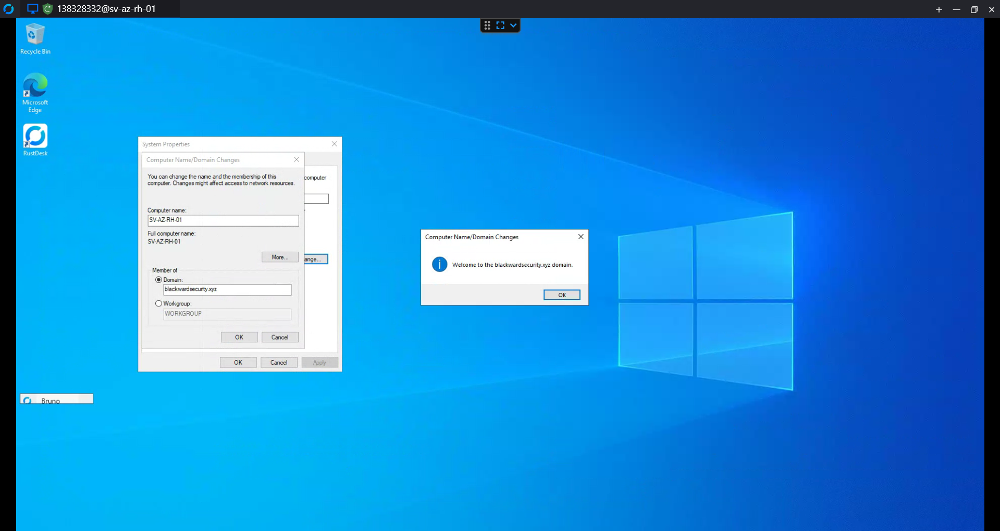
 ㅤㅤㅤㅤㅤㅤㅤㅤㅤㅤㅤㅤㅤㅤㅤㅤㅤㅤㅤㅤㅤㅤㅤㅤㅤㅤfigura 8: Máquina RH adicionada ao domínio


 ㅤㅤㅤㅤㅤㅤㅤㅤㅤㅤㅤㅤㅤㅤㅤㅤㅤㅤㅤㅤㅤㅤㅤㅤㅤㅤfigura 8: Máquina Vendas adicionada ao domínio

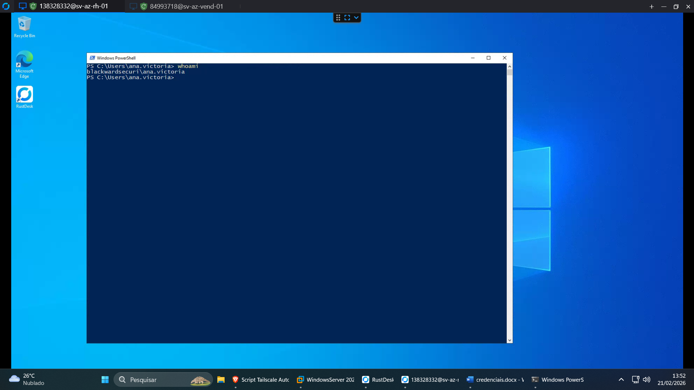
 ㅤㅤㅤㅤㅤㅤㅤㅤㅤㅤㅤㅤㅤㅤㅤㅤㅤㅤㅤㅤㅤㅤㅤㅤㅤㅤfigura 8: Login com usuária do RH
 
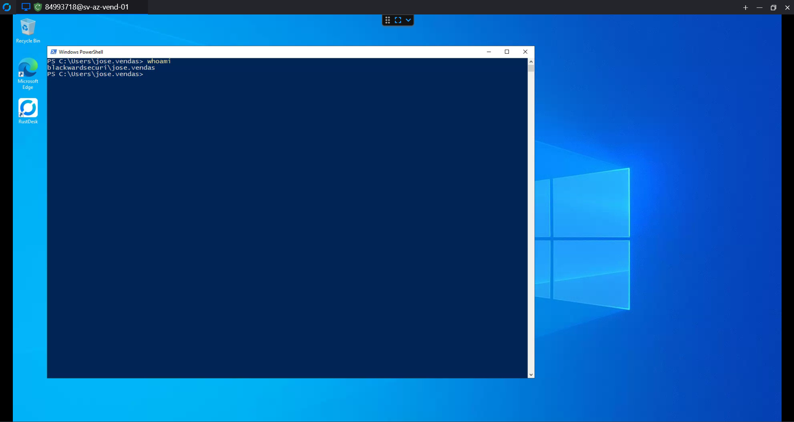
 ㅤㅤㅤㅤㅤㅤㅤㅤㅤㅤㅤㅤㅤㅤㅤㅤㅤㅤㅤㅤㅤㅤㅤㅤㅤㅤfigura 8: Login com usuário de Vendas

## **3.3.5 Skills e Competências Adquiridas**
 
A execução deste módulo reforçou habilidades fundamentais em infraestrutura como serviço (IaaS) e operações híbridas.
 
| **Área** | **Competência** |
|---|---|
| ☁️ **Cloud FinOps** | Criação de Action Groups, Runbooks em PowerShell e controle de Budget na Azure para evitar billing shock associado a IaaS e Compute. |
| 🤖 **Automação (PowerShell)** | Provisionamento headless de pacotes via Chocolatey, manipulação de serviços, injeção silenciosa de credenciais (RustDesk) e manipulação dinâmica de categorias de rede (Public vs. Private profiles). |
| 🌐 **Troubleshooting Avançado** | Diagnóstico preciso do comportamento de DNS Round Robin em controladores de domínio multi-homed (múltiplas interfaces) e resolução baseada em prioridade local (`hosts`). |
| 🔐 **Microssegmentação / Firewalling** | Manipulação programática do Windows Defender Firewall (`New-NetFirewallRule`) focada em escopos IP limitados (`100.64.0.0/10`) para sustentar arquiteturas Zero Trust. |

---
 
## **3.3.6 Padronização do Tecido de Identidade (Correio e UPN)**
 
Antes de iniciar qualquer sincronização, as identidades foram rigorosamente padronizadas. Contas de e-mail (ex: `bruno.analyst@blackwardsecurity.xyz`, `jose.vendas@blackwardsecurity.xyz`) e listas de distribuição corporativas (ex: `ti@`, `rh@`) foram criadas no Zoho Mail e alinhadas aos atributos UPN dos objetos no AD.
 
**Por que:** Em cenários de Red Team (testes de phishing e movimentação lateral) e Blue Team (investigação de exfiltração via e-mail), é mandatório que o objeto do usuário no AD tenha exata correspondência com sua caixa de correio real. Um UPN que não resolve para uma caixa válida quebra a fidelidade das simulações. Essa consistência cria um ambiente de altíssima fidelidade para ambos os times.
 
 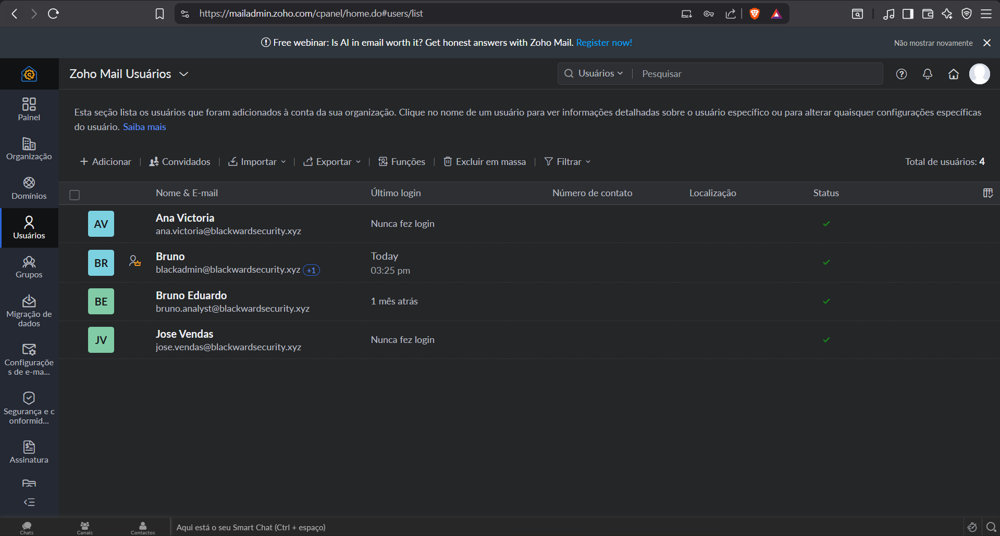
 ㅤㅤㅤㅤㅤㅤㅤㅤㅤㅤㅤㅤㅤㅤㅤㅤㅤㅤㅤㅤㅤㅤㅤㅤㅤㅤfigura 8: Usuários criados no zoho mail

 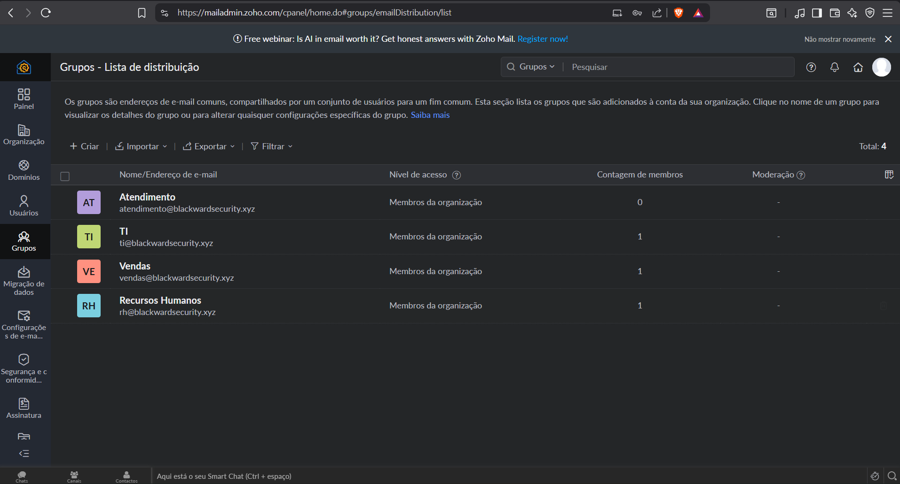
 ㅤㅤㅤㅤㅤㅤㅤㅤㅤㅤㅤㅤㅤㅤㅤㅤㅤㅤㅤㅤㅤㅤㅤㅤㅤㅤfigura 8: Grupos criados no zoho mail

---
 
## **3.3.7 Validação de Domínio e Autenticação DNS (Cloudflare)**
 
Para garantir a integridade do namespace corporativo, o domínio `blackwardsecurity.xyz` foi verificado perante a Microsoft através da criação de um registro TXT no Cloudflare:
 
| Tipo | Nome | Valor |
|---|---|---|
| TXT | @ | `MS=ms34900680` |
 
**Por que:** Sem essa validação, o Entra ID faria um *fallback* de todas as identidades sincronizadas, alterando forçadamente os logins para o domínio temporário `@<tenant>.onmicrosoft.com`. A verificação via DNS garantiu que todos os UPNs sincronizados mantivessem o formato `@blackwardsecurity.xyz`, preservando a integridade do namespace em toda a cadeia de identidade.
  
 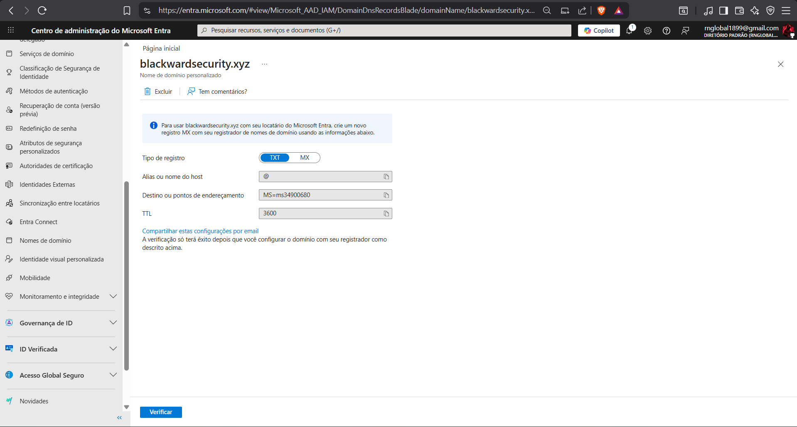
 ㅤㅤㅤㅤㅤㅤㅤㅤㅤㅤㅤㅤㅤㅤㅤㅤㅤㅤㅤㅤㅤㅤㅤㅤㅤㅤfigura 8: TXT para adicionar ao CloudFlare

 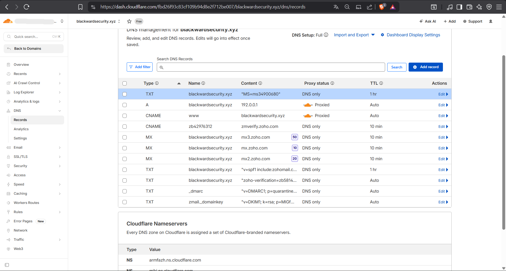
 ㅤㅤㅤㅤㅤㅤㅤㅤㅤㅤㅤㅤㅤㅤㅤㅤㅤㅤㅤㅤㅤㅤㅤㅤㅤㅤfigura 8: Registro DNS adicionado ao CloudFlare

---
 
## **3.3.8 Governança e Princípio do Menor Privilégio (PoLP)**
 
> **Princípio Arquitetural:** Separação de Privilégios na Nuvem. A maioria das empresas comete o erro crítico de utilizar uma conta de *Global Admin* para a instalação do Entra Connect — expondo toda a assinatura Azure a uma credencial que estará persistida na memória de um servidor on-premises.
 
Para realizar a sincronização, criei um usuário dedicado na nuvem (`adsync@blackwardsecurity.xyz`) e atribuí a ele estritamente a função de **Hybrid Identity Administrator**, ativando o MFA logo no primeiro acesso.
 
**Por que:** Ao aplicar o Princípio do Menor Privilégio (PoLP), garanto que, se o servidor local for comprometido e a credencial for extraída da memória (ex: via Mimikatz/LSASS dump), o raio de explosão fica contido: a conta só tem escopo para gerenciar usuários do diretório. O restante da infraestrutura Azure — bancos de dados, assinaturas, políticas de segurança — permanece isolado e protegido.
 
| Parâmetro | Decisão |
|---|---|
| **Conta de Serviço** | `adsync@blackwardsecurity.xyz` (dedicada, não compartilhada) |
| **Função Atribuída** | Hybrid Identity Administrator (não Global Admin) |
| **MFA** | Ativado no primeiro acesso |
| **Escopo de Comprometimento** | Limitado à gestão de objetos de usuário |
 
  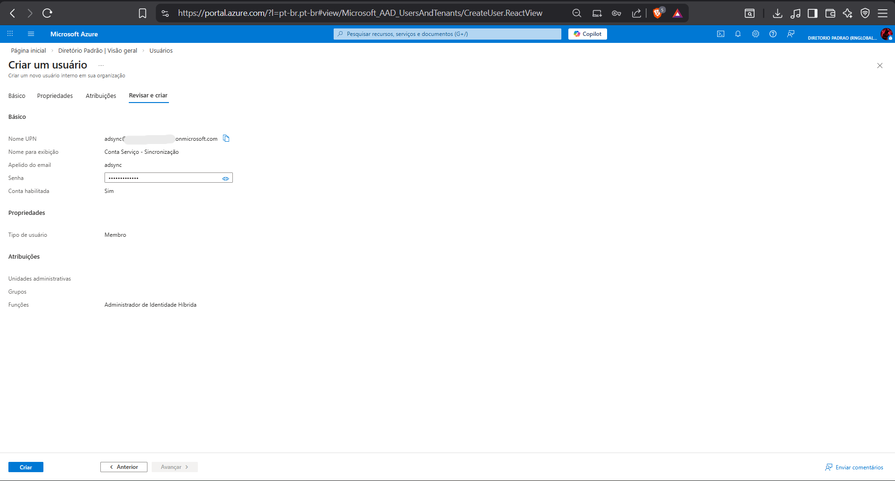
 ㅤㅤㅤㅤㅤㅤㅤㅤㅤㅤㅤㅤㅤㅤㅤㅤㅤㅤㅤㅤㅤㅤㅤㅤㅤㅤfigura 8: Usuário dedicado para sync

---
 
## **3.3.9 Instalação Customizada do Microsoft Entra Connect**
 
A instalação do Microsoft Entra Connect foi conduzida rejeitando expressamente a opção "Express Settings", optando pela configuração **Custom**. Essa escolha não é preferência estética — a instalação expressa aplica permissões e escopos de sincronização que reduzem a visibilidade e o controle granular necessários para um laboratório de segurança.
 
| Parâmetro | Configuração Aplicada |
|---|---|
| **Modo de Instalação** | Custom (Express Settings rejeitado) |
| **Método de Sincronização** | Password Hash Sync (PHS) |
| **Single Sign-On** | Ativado (SSO Seamless) |
| **Banco de Dados** | LocalDB (provisionado nativamente pelo assistente) |
| **Conta de Serviço AD** | Provisionada automaticamente pelo assistente (MSOL_) |
 
### **Decisão Arquitetural — Red Team: Injeção Deliberada da Conta `MSOL_`**
 
> **Decisão Arquitetural (Red Team):** Ao não fornecer uma conta de serviço pré-existente durante a instalação, o assistente é obrigado a provisionar automaticamente a conta `MSOL_` com **privilégios de replicação de diretório** (*Directory Replication Service*). Esta conta é um alvo primário documentado para o ataque **DCSync** — uma técnica que simula o comportamento de um Domain Controller secundário para extrair hashes NT de todos os usuários do domínio sem gerar logs de acesso direto ao NTDS.dit. Sua presença foi deliberadamente planejada para viabilizar os cenários ofensivos do Módulo 4.
 
### **Decisão Arquitetural — Blue Team: Filtragem Cirúrgica de OUs**
 
A etapa de OU Filtering é onde a maioria das instalações corporativas falha por omissão. A prática padrão de sincronizar a raiz do domínio inteira expõe contas de serviço e objetos de infraestrutura à nuvem — ampliando desnecessariamente a superfície de ataque.
 
A abordagem adotada foi oposta: a raiz do domínio foi desmarcada e apenas as OUs de negócio foram selecionadas manualmente.
 
| OU Sincronizada | Justificativa |
|---|---|
| **TI/SOC** | Contas humanas de analistas — objeto legítimo de governança de nuvem |
| **RH** | Contas humanas departamentais — idem |
| **VENDAS** | Contas humanas departamentais — idem |
| ~~Builtin~~ | **Bloqueado** — contas de serviço nativas do Windows Server |
| ~~Domain Controllers~~ | **Bloqueado** — objetos de infraestrutura crítica jamais devem transitar para a nuvem |
| ~~Computers~~ | **Bloqueado** — contas de máquina não têm identidade humana no Entra ID |
 
**Por que:** Essa filtragem reduziu drasticamente a superfície de ataque e o ruído de sincronização, garantindo que o Entra ID recebesse estritamente os usuários humanos que farão login nos ativos corporativos — e nada mais.
 
---
 
   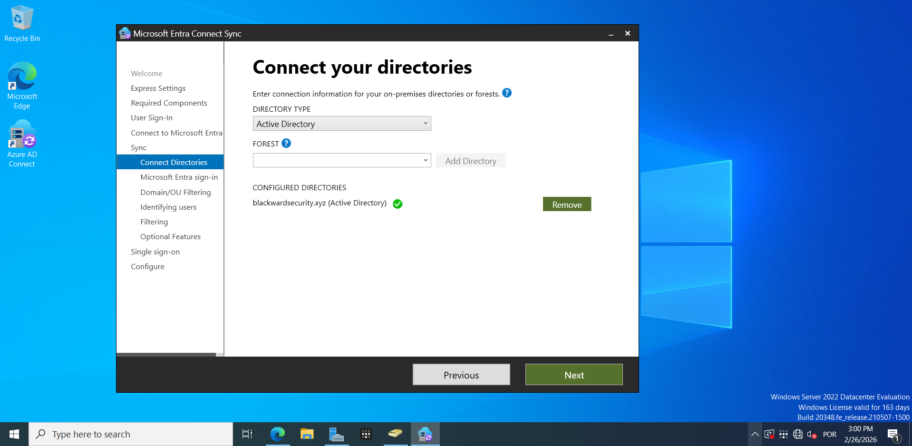
 ㅤㅤㅤㅤㅤㅤㅤㅤㅤㅤㅤㅤㅤㅤㅤㅤㅤㅤㅤㅤㅤㅤㅤㅤㅤㅤfigura 8: Diretório conectado

   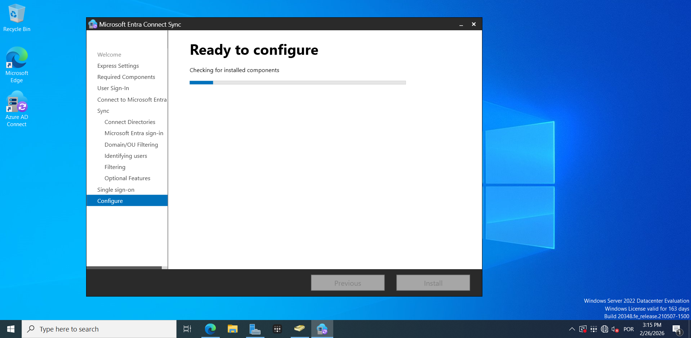
 ㅤㅤㅤㅤㅤㅤㅤㅤㅤㅤㅤㅤㅤㅤㅤㅤㅤㅤㅤㅤㅤㅤㅤㅤㅤㅤfigura 8: Instalando entra connect

   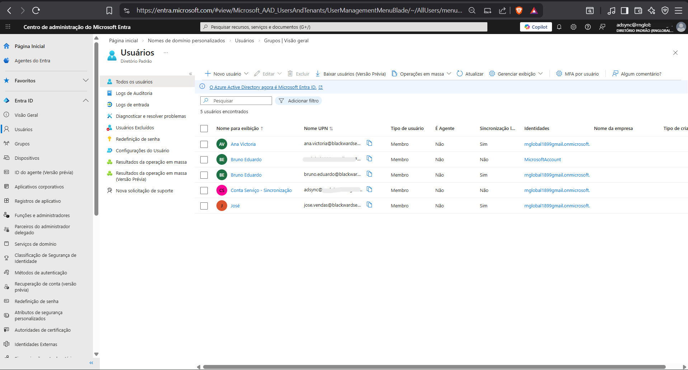
 ㅤㅤㅤㅤㅤㅤㅤㅤㅤㅤㅤㅤㅤㅤㅤㅤㅤㅤㅤㅤㅤㅤㅤㅤㅤㅤfigura 8: Usuários adicionados ao azure

## **3.3.10 Skills e Competências Adquiridas**
 
A integração híbrida validou competências avançadas que unem a administração de infraestrutura com a visão estratégica de um especialista em segurança.
 
| **Área** | **Competência** |
|---|---|
| ☁️ **Cloud IAM (Identity & Access Management)** | Federação de diretórios locais com Microsoft Entra ID via Azure AD Connect, validação de FQDN via registros TXT (Cloudflare) e aplicação de RBAC estrito (Hybrid Identity Admin). |
| 🛡️ **SecOps / Blue Team (Defesa)** | Redução sistemática de superfície de ataque em ambientes híbridos através de OU Filtering, impedindo a exposição de contas de serviço e objetos de infraestrutura críticos à nuvem. |
| ⚔️ **Engenharia Ofensiva / Red Team** | Modelagem deliberada de ameaças *(Threat Modeling)* durante o provisionamento, injetando intencionalmente alvos de alto valor (conta `MSOL_`) para viabilizar simulações de ataques de replicação de diretório (DCSync). |
| 🔐 **Governança Zero Trust** | Implementação de fluxos de autenticação unificados (SSO e Password Hash Sync) amarrados ao Princípio do Menor Privilégio (PoLP) e MFA na fundação da arquitetura. |