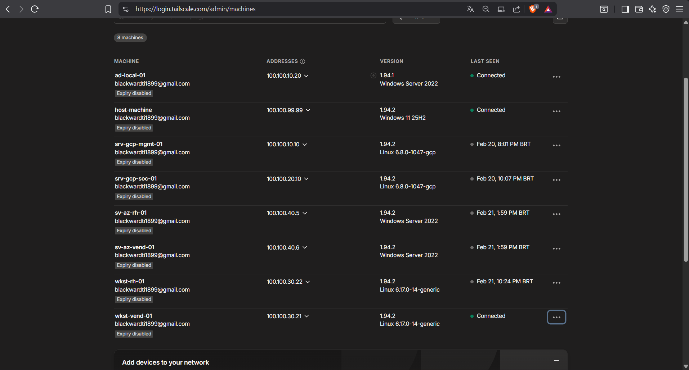
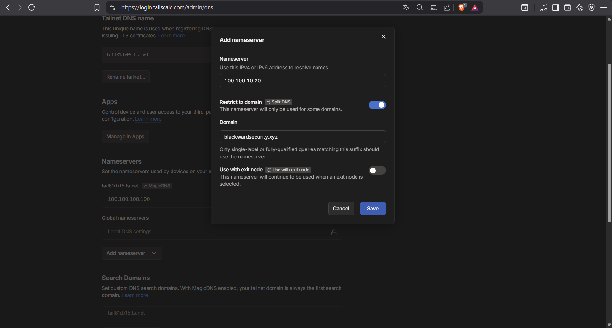
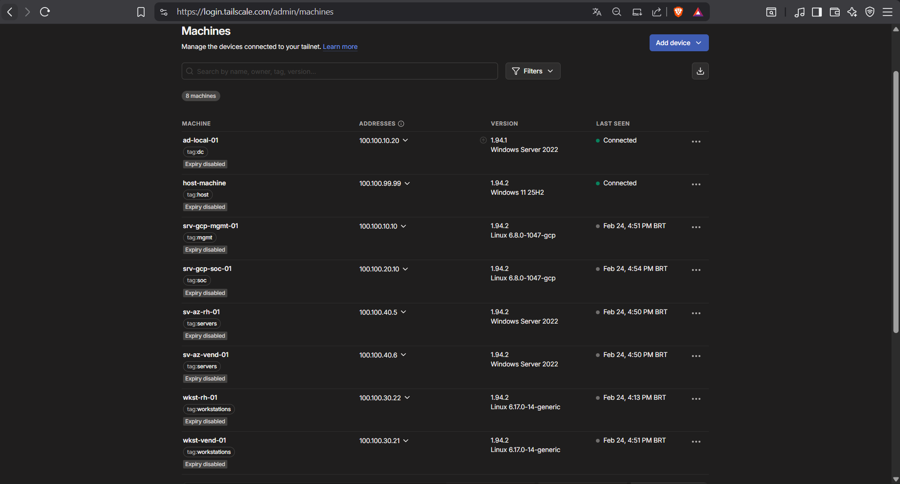

# **3.5. Arquitetura Zero Trust e Microsegmentação SD-WAN (Tailscale)**
 
`Tailscale` `Zero Trust Network Access (ZTNA)` `Microsegmentation` `HuJSON ACLs`
 
| | |
|---|---|
| **Analista Responsável** | Bruno Eduardo |
| **Última Atualização** | 17 de Abril de 2026 |
 
---
 
Este relatório detalha a transição do laboratório de uma topologia de rede plana (*flat network*) para uma arquitetura estrita de Microsegmentação e Zero Trust. Utilizando a malha overlay do Tailscale (SD-WAN), o objetivo arquitetural foi restringir o tráfego lateral ao mínimo necessário para a operação. Essa postura garante a proteção da máquina física contra infecções cruzadas, blinda o servidor SIEM e mapeia rotas intencionais para viabilizar simulações realistas de movimentação lateral e *Pivoting* por parte do Red Team.
 
---
 
## **3.5.1 Padronização de Endereçamento e Forwarding de DNS**
 
Antes de aplicar as restrições lógicas, o alicerce da rede foi consolidado. Os cinco nós principais da infraestrutura multicloud foram ingressados na tailnet e seus IPs sobrepostos (overlay) foram padronizados, dividindo-os logicamente em sub-redes virtuais no espaço `100.100.x.x`:
 
| Ativo | Papel na Infraestrutura | IP Tailscale (Overlay) |
|---|---|---|
| AD-LOCAL-01 | Domain Controller (Local) | 100.100.10.20 |
| SRV-GCP-MGMT-01 | Bastion / Gerenciamento (GCP) | 100.100.10.10 |
| SRV-GCP-SOC-01 | SIEM / Telemetria (GCP) | 100.100.20.10 |
| SV-AZ-RH-01 | Servidor Windows — RH (Azure) | 100.100.40.5 |
| SV-AZ-VEND-01 | Servidor Windows — Vendas (Azure) | 100.100.40.6 |
 
**Engenharia de DNS (Global Nameserver):** Para que instâncias no Canadá (Azure) e na Carolina do Sul (GCP) pudessem resolver o domínio interno `blackwardsecurity.xyz` sem depender de DNS público, o IP do DC (`100.100.10.20`) foi configurado no painel do Tailscale como Nameserver global, com a opção **"Override DNS servers"** ativada.
 
A eficácia do forwarding foi validada a partir da máquina física via PowerShell:
 
```powershell
# Validação de conectividade L3 (ICMP)
ping 100.100.10.10   # SRV-GCP-MGMT-01
ping 100.100.20.10   # SRV-GCP-SOC-01
ping 100.100.40.5    # SV-AZ-RH-01
ping 100.100.40.6    # SV-AZ-VEND-01
 
# Validação de resolução de nomes via DNS forwarding
Resolve-DnsName srv-gcp-mgmt-01.blackwardsecurity.xyz
Resolve-DnsName srv-gcp-soc-01.blackwardsecurity.xyz
Resolve-DnsName sv-az-rh-01.blackwardsecurity.xyz
Resolve-DnsName sv-az-vend-01.blackwardsecurity.xyz
 
# Validação cruzada: ping por nome (combina L3 + DNS)
ping srv-gcp-mgmt-01
ping sv-az-vend-01
```
 
 ㅤㅤㅤㅤㅤㅤㅤㅤㅤㅤㅤㅤㅤㅤㅤㅤㅤㅤㅤㅤㅤㅤㅤㅤㅤㅤfigura 1: Dispositivos conectados

 
 ㅤㅤㅤㅤㅤㅤㅤㅤㅤㅤㅤㅤㅤㅤㅤㅤㅤㅤㅤㅤㅤㅤㅤㅤㅤㅤfigura 2: Dns split

---
 
## **3.5.2 Governança de Tags e Postura "Default Deny"**
 
### **Transição para Identidade Baseada em Tags (Tag Owners)**
 
Em ambientes multicloud e laboratórios dinâmicos, endereços IP são efêmeros. Depender de IPs para regras de firewall é uma prática frágil e propensa a falhas operacionais.
 
Para resolver isso, o controle de acesso foi refatorado no arquivo de configuração (HuJSON), passando a ser baseado na **identidade da máquina (Tags)**. Através da diretiva `tagOwners`, apenas usuários no grupo administrativo podem designar perfis às máquinas. Assim, uma regra atrelada à `tag:workstations` é aplicada instantaneamente, quer o laboratório possua uma ou cinquenta instâncias ativas.
 
```json
"tagOwners": {
  "tag:soc":          ["autogroup:admin"],
  "tag:mgmt":         ["autogroup:admin"],
  "tag:dc":           ["autogroup:admin"],
  "tag:servers":      ["autogroup:admin"],
  "tag:workstations": ["autogroup:admin"],
  "tag:host":         ["autogroup:admin"]
}
```
 
### **O Descarte Base (Default Deny)**
 
> **Princípio Arquitetural: Zero Trust começa com a negação total.** A regra padrão que acompanha novas redes Tailscale — `{ "action": "accept", "src": ["*"], "dst": ["*:*"] }` — foi sumariamente deletada. A partir deste ponto, qualquer pacote que não corresponda explicitamente às ACLs abaixo é descartado (*dropped*) em silêncio pelo kernel do sistema operacional, antes mesmo de penetrar no túnel criptografado. Não existe "permitido por padrão" nesta rede.
 
 
 ㅤㅤㅤㅤㅤㅤㅤㅤㅤㅤㅤㅤㅤㅤㅤㅤㅤㅤㅤㅤㅤㅤㅤㅤㅤㅤfigura 2: Tags criadas

---
 
## **3.5.3 Engenharia de ACLs: As Rotas e os Motivos**
 
A rede foi microsegmentada em cinco fluxos de tráfego, todos baseados no Princípio do Menor Privilégio. Abaixo, cada regra é apresentada junto ao seu racional de segurança.
 
### **A. O Cofre de Telemetria (SOC/SIEM)**
 
O servidor Elastic atua como um "cofre cego": não tem permissão para iniciar conexões contra os endpoints, mas precisa que a rede chegue até ele para depositar logs. Foram abertas estritamente as portas vitais de telemetria.
 
> **Visão de SecOps (Blue Team):** Se um servidor na Azure for comprometido, a arquitetura garante que o invasor não conseguirá realizar movimentos laterais contra o SOC via SSH (porta 22) ou RDP — apenas as portas de ingestão de telemetria estão abertas, limitando o *blast radius*.
 
```json
{
  "action": "accept",
  "src":    ["*"],
  "dst":    ["tag:soc:8220", "tag:soc:5601", "tag:soc:9200"]
}
```
 
| Porta | Serviço |
|---|---|
| 8220 | Fleet Server (registro de Elastic Agents) |
| 9200 | Ingestão de logs (Elasticsearch API) |
| 5601 | Kibana Web UI |
 
### **B. O Bastion Host e Serviços de Gestão**
 
A VM de gerenciamento (`tag:mgmt`) funciona como a "porta da frente" administrativa da infraestrutura, possuindo passe livre para acessar qualquer máquina. Em contrapartida, todos os endpoints têm acesso restrito à gestão apenas nas portas dos serviços operacionais.
 
```json
// Gestão tem acesso irrestrito a toda a infraestrutura
{ "action": "accept", "src": ["tag:mgmt"], "dst": ["*:*"] },
 
// Toda a rede pode acessar os serviços publicados na gestão
{ "action": "accept", "src": ["*"], "dst": ["tag:mgmt:8081"] },
{ "action": "accept", "src": ["*"], "dst": ["tag:mgmt:443"] },
 
// Gestão pode consultar o diretório LDAP do AD
{ "action": "accept", "src": ["tag:mgmt"], "dst": ["tag:dc:389"] }
```
 
| Porta | Serviço |
|---|---|
| 8081 | GLPI (Inventário de Ativos) |
| 443 | MeshCentral (Acesso Remoto Centralizado) |
| 389 | LDAP (Consulta ao Active Directory) |
 
### **C. A Trilha de Autenticação (Active Directory)**
 
Para não quebrar a operabilidade corporativa, endpoints (*workstations* e *servers*) têm acesso livre ao controlador de domínio (`tag:dc:*`). Isso assegura o tráfego de Kerberos, DNS, LDAP e SMB necessários para login de usuários, aplicação de GPOs e sincronismo do Entra Connect.
 
```json
{
  "action": "accept",
  "src":    ["tag:workstations", "tag:servers"],
  "dst":    ["tag:dc:*"]
}
```
 
> **Nota de Estado Atual:** Esta regra permite acesso irrestrito a todas as portas do DC temporariamente. O refinamento planejado é restringir o escopo às portas estritamente necessárias para cada protocolo (88/Kerberos, 389/LDAP, 445/SMB, 53/DNS), reduzindo ainda mais a superfície de ataque do ativo mais crítico da rede.
 
### **D. O Vetor de Ataque Intencional (Rota de Pivot do Red Team)**
 
Um laboratório de segurança perde seu propósito se for intransponível. A regra abaixo é uma "falha" de segmentação desenhada de forma deliberada: *workstations* locais podem iniciar conexões contra os servidores hospedados na Azure, mas o caminho inverso é negado por padrão.
 
> **Cenário de Ameaça Simulado:** Se um ator malicioso infectar uma Workstation local (via Phishing), esta ACL permitirá que o malware descubra a sub-rede em nuvem, execute varreduras (*nmap*/portscans) e inicie a exploração contra os alvos de alto valor (Servidores RH/Vendas). O caminho de *Pivot* é real, controlado e documentado.
 
```json
{
  "action": "accept",
  "src":    ["tag:workstations"],
  "dst":    ["tag:servers:*"]
}
```
 
### **E. O Isolamento do Host Físico (Stateful Firewall)**
 
A máquina física do analista (`tag:host`) recebe controle administrativo total sobre o laboratório (`*:*`). No entanto, **não existe nenhuma regra correspondente** permitindo que o laboratório alcance o host.
 
> **Princípio Arquitetural: Assimetria de Iniciação como Proteção.** O WireGuard/Tailscale opera como um firewall *Stateful* — conexões iniciadas pelo analista (ex: sessão SSH) permitem o tráfego de retorno. Contudo, se um Worm ou Ransomware autônomo dentro da Azure tentar escanear a rede privada em busca de novas vítimas, os pacotes direcionados à máquina pessoal são destruídos instantaneamente pela ausência de uma regra explícita de iniciação. A máquina física interage com o laboratório; o laboratório jamais toca a máquina física.
 
```json
{
  "action": "accept",
  "src":    ["tag:host"],
  "dst":    ["*:*"]
}
```
 
---
 
## **3.5.4 Skills e Competências Adquiridas**
 
A criação deste módulo elevou profundamente o conhecimento em engenharia de tráfego, gestão de infraestrutura como código (IaC) e segurança defensiva.
 
| **Área** | **Competência** |
|---|---|
| 🔐 **Zero Trust Network Access (ZTNA)** | Design e implementação de redes *Default Deny*, superando as limitações de firewalls baseados em perímetro físico em ambientes multicloud descentralizados. |
| 🛡️ **Microsegmentação (SecOps)** | Implementação prática do Princípio do Menor Privilégio a nível de camada de rede e transporte (Layer 3/4), modelando regras estritas por serviço (portas 8220, 9200, 443). |
| ☁️ **Infraestrutura Orientada a Identidade** | Abstração de regras de firewall baseadas em IPs estáticos ou CIDRs efêmeros, adotando ACLs em formato HuJSON gerenciadas via políticas de Tag (*Tag Owners*). |
| ⚔️ **Red Teaming (Vetorização)** | Compreensão técnica sobre movimentação lateral e *Pivoting* de rede, desenhando rotas permissivas unidirecionais para habilitar simulações futuras da cadeia de eliminação (*Kill Chain*). |