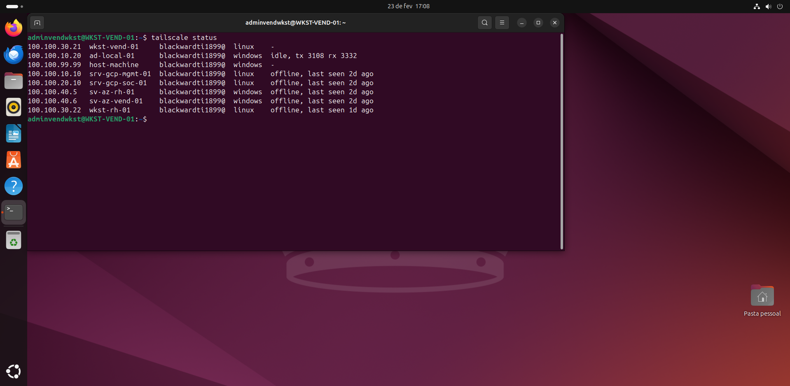
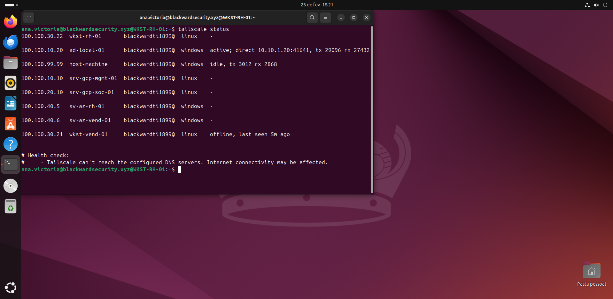
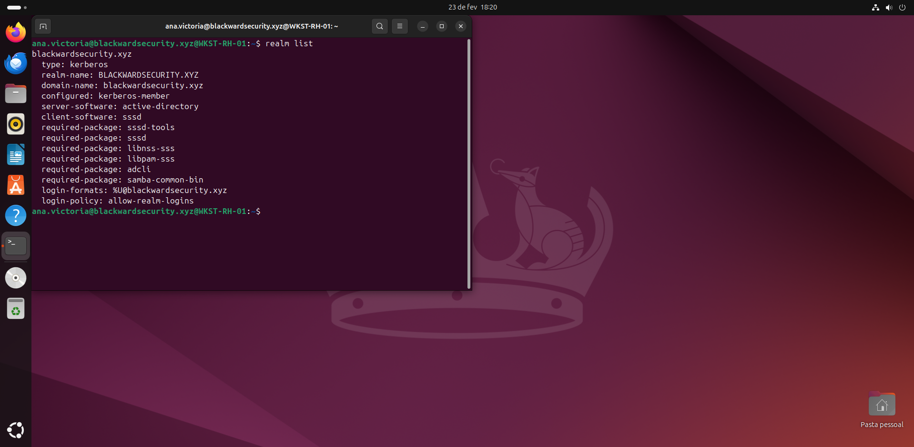
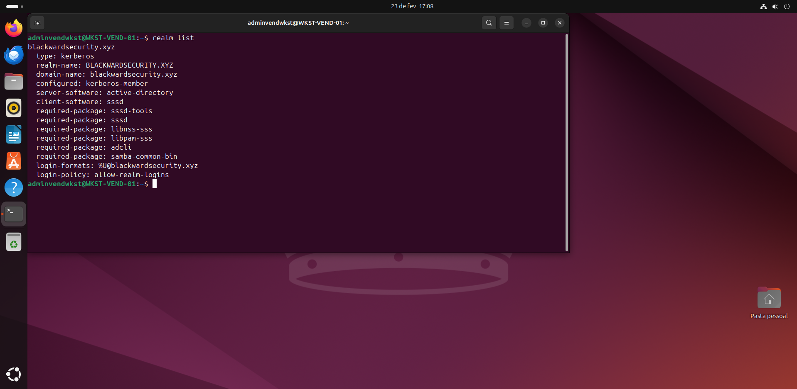
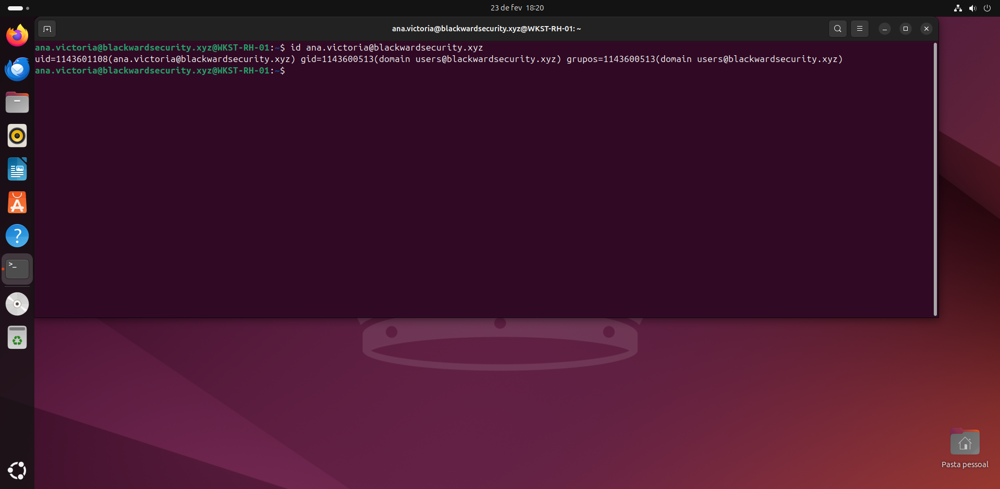
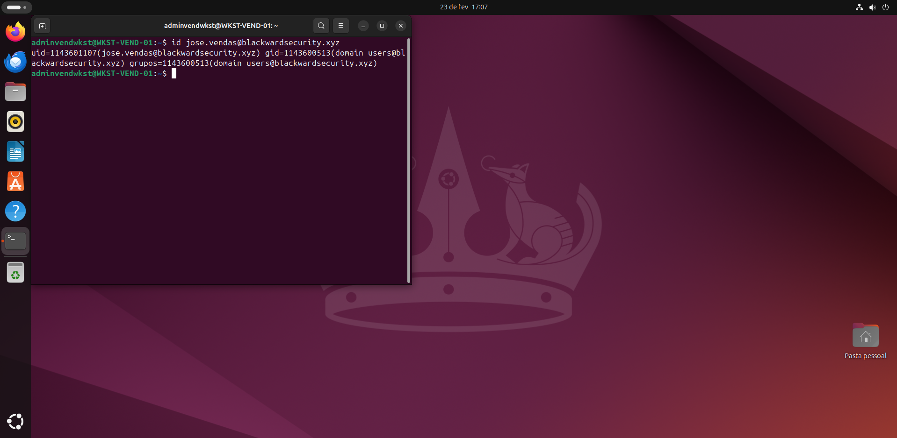

# **3.2 Provisionamento de Endpoints Heterogêneos: Workstations Linux (RH e Vendas)**
 
`Ubuntu Linux` `SSSD & realmd` `Tailscale Headless` `Kerberos`
 
| | |
|---|---|
| **Analista Responsável** | Bruno Eduardo |
| **Última Atualização** | 15 de Abril de 2026 |
 
---
 
Este relatório detalha o processo de ingresso de endpoints baseados em UNIX (Ubuntu) no domínio corporativo Windows (AD DS). O objetivo arquitetural desta etapa foi simular a interoperabilidade real de um ecossistema corporativo moderno — conhecido como *Heterogeneous OS Environment* —, onde sistemas operacionais distintos devem estar submetidos à mesma governança central de identidade, segmentação de rede e telemetria de segurança.
 
---
 
## **3.2.1 Racional de Interoperabilidade e Persistência do Túnel**
 
### **Decisão Estratégica: Daemonização da Malha SD-WAN**
 
Diferente do ecossistema Windows, onde clientes VPN frequentemente operam em nível de usuário (User-Space), a introdução de endpoints Linux em um domínio remoto exige que a conectividade preceda a autenticação. Se a conexão com a malha Tailscale dependesse do login de um usuário local, contas do Active Directory jamais conseguiriam se autenticar remotamente na tela de bloqueio (GDM/LightDM), pois o túnel para o Controlador de Domínio estaria inativo.
 
Para solucionar esse impasse arquitetural, o Tailscale foi implementado em modo *Headless* e atrelado ao systemd. Dessa forma, a autenticação da máquina na rede Zero Trust passa a ser vinculada ao ciclo de vida (boot) do sistema operacional, e não ao estado da sessão do usuário.
 
> **Princípio Arquitetural:** Identidade Baseada em Máquina *(Machine-Identity First)*. A infraestrutura deve reconhecer e autorizar o ativo computacional na malha de rede criptografada antes mesmo que a camada de aplicação tente federar a identidade do usuário humano.
 
| **Parâmetro** | **Valor / Decisão** |
|---|---|
| **Sistemas Operacionais** | Ubuntu Server / Desktop (VMs) |
| **Setores Simulados** | RH (wkst-rh-01) e Vendas (wkst-vend-01) |
| **Gerenciador de Serviço** | systemd (serviço tailscaled persistente no boot) |
| **Método de Autenticação** | AuthKey não-efêmera (Headless Auth via CLI) |
 
---
 
## **3.2.2 Conectividade Zero Trust e Injeção de Rotas**
 
O script de provisionamento (bash) foi desenhado para garantir uma instalação idempotente e a correta manipulação do tráfego DNS. O comando de ingresso na malha (`tailscale up`) exigiu parâmetros rigorosos para contornar problemas de *DNS Round Robin* que haviam ocorrido previamente.
 
- `--authkey=${AUTH_KEY}`: Utilização de chave de autenticação pré-compartilhada para ingresso automatizado, vital para fluxos de CI/CD ou provisionamento em massa via Ansible no futuro.
- `--accept-dns` e `--accept-routes`: **Decisão Crítica**. Esses parâmetros forçam o host Linux a sobrescrever sua resolução de nomes local (systemd-resolved) e aceitar as configurações de MagicDNS empurradas pelo painel de controle do Tailscale. Sem isso, o Linux jamais conseguiria resolver o registro SRV `_ldap._tcp.blackwardsecurity.xyz` que aponta para o IP estático `100.100.10.20` do DC.

Após isso o tailscale foi conectado em ambas as máquinas com sucesso:

ㅤㅤㅤㅤㅤㅤㅤㅤㅤㅤㅤㅤㅤㅤㅤㅤㅤㅤㅤㅤㅤㅤㅤㅤㅤㅤㅤㅤㅤㅤfigura 4: Taiscale conectado na wkst de vendas

ㅤㅤㅤㅤㅤㅤㅤㅤㅤㅤㅤㅤㅤㅤㅤㅤㅤㅤㅤㅤㅤㅤㅤㅤㅤㅤㅤㅤㅤㅤfigura 4: Taiscale conectado na wkst do rh

---
 
## **3.2.3 Federação de Identidade (AD DS + SSSD)**
 
Com a conectividade L3 (WireGuard) e L7 (DNS) garantidas e apontando exclusivamente para o hub de identidade local, iniciou-se o processo de ingresso dos sistemas no domínio.
 
Em vez de métodos legados (como Winbind), optou-se pela stack moderna de autenticação Linux baseada no **SSSD (System Security Services Daemon)**, orquestrada pelo utilitário realmd. O SSSD é preferível em ambientes corporativos por sua capacidade de fazer cache de credenciais (permitindo logon offline) e sua excelente integração nativa com políticas de acesso.
 
| **Pacote / Utilitário** | **Função na Arquitetura** |
|---|---|
| realmd / adcli | Discovery automático de registros SRV do AD e ingresso da máquina (Computer Object). |
| sssd / sssd-tools | Daemon que atua como ponte entre o Linux e os serviços de diretório (LDAP) e autenticação (Kerberos). |
| libpam-sss | Módulo PAM para permitir que a tela de login do Ubuntu valide credenciais contra o SSSD. |
| oddjob-mkhomedir | Módulo PAM para criação automática do diretório `/home/usuario` no primeiro login da conta de domínio. |
 
Durante o comando `realm discover blackwardsecurity.xyz`, o tráfego foi roteado através do túnel Tailscale, o AD respondeu ao desafio, e o ingresso foi finalizado com `realm join` utilizando as credenciais administrativas (bruno.eduardo). A política de *Pluggable Authentication Modules* (PAM) foi atualizada para mimetizar o comportamento do Windows na criação de perfis locais.
 
 
ㅤㅤㅤㅤㅤㅤㅤㅤㅤㅤㅤㅤㅤㅤㅤㅤㅤㅤㅤㅤㅤㅤㅤㅤㅤㅤㅤㅤㅤㅤfigura 4: wkst rh no domínio

ㅤㅤㅤㅤㅤㅤㅤㅤㅤㅤㅤㅤㅤㅤㅤㅤㅤㅤㅤㅤㅤㅤㅤㅤㅤㅤㅤㅤㅤㅤfigura 4: wkst vendas no domínio

---
 
## **3.2.4 Validação de Telemetria**
 
Após o provisionamento, as consultas de identificação responderam com sucesso:
 
- Execução de `id ana.victoria@blackwardsecurity.xyz` validou a integração do endpoint de RH.
- Execução de `id jose.vendas@blackwardsecurity.xyz` validou o endpoint de Vendas.

 
ㅤㅤㅤㅤㅤㅤㅤㅤㅤㅤㅤㅤㅤㅤㅤㅤㅤㅤㅤㅤㅤㅤㅤㅤㅤㅤㅤ ㅤfigura 4: comunicação com sucesso na wkst rh

ㅤㅤㅤㅤㅤㅤㅤㅤㅤㅤㅤㅤㅤㅤㅤㅤㅤㅤㅤㅤㅤㅤㅤㅤㅤㅤfigura 4: comunicação com sucesso na wkst vendas

---
 
## **3.2.5 Skills e Competências Adquiridas**
 
As competências validadas nesta etapa demonstram proficiência na integração complexa de ambientes híbridos, indo além da simples administração de um único sistema operacional.
 
| **Área** | **Competência** |
|---|---|
| 🐧 **Sysadmin / Linux Avançado** | Manipulação avançada do systemd, gerenciamento de daemons críticos (tailscaled, sssd), automação em Bash e configuração profunda do framework PAM. |
| 🪪 **Federação de Identidades** | Integração *cross-platform* (Linux → Windows) utilizando protocolos padrão da indústria (Kerberos V5 e LDAP via SSSD/realmd). |
| 🛡️ **Engenharia Zero Trust** | Implementação de *Headless Node Authentication*, manipulação de tabelas de roteamento e injeção de DNS condicional via túneis WireGuard L3. |
| 🔍 **Troubleshooting Lógico** | Capacidade de diagnosticar falhas de ingresso de domínio como problemas inerentes de infraestrutura de rede/DNS (`--accept-dns`) e não como falhas da camada de aplicação. |